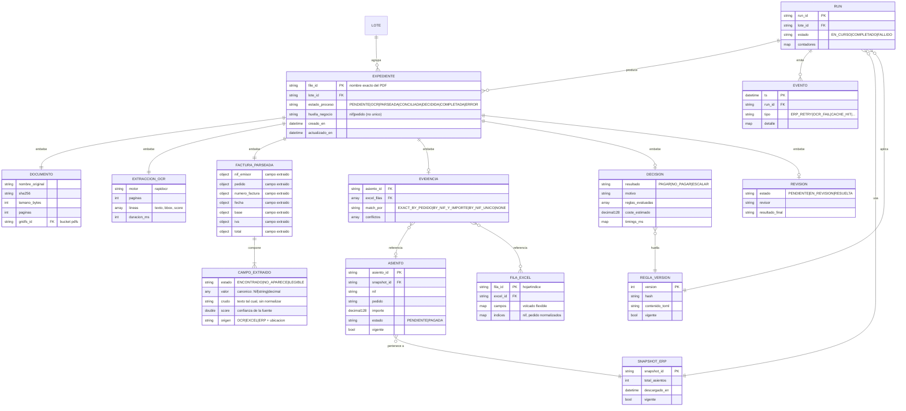
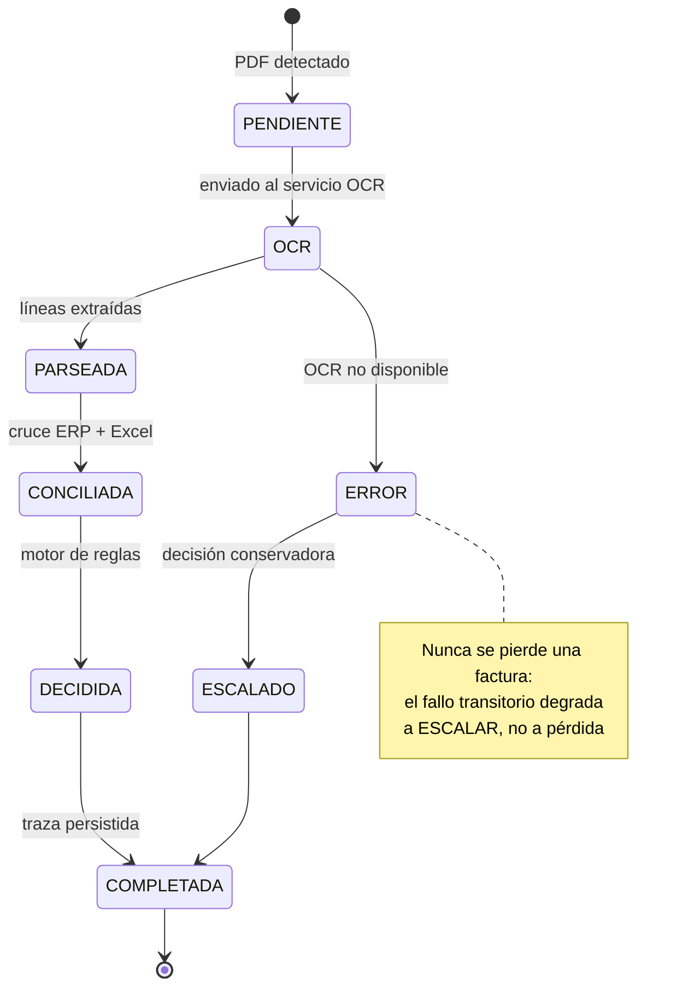
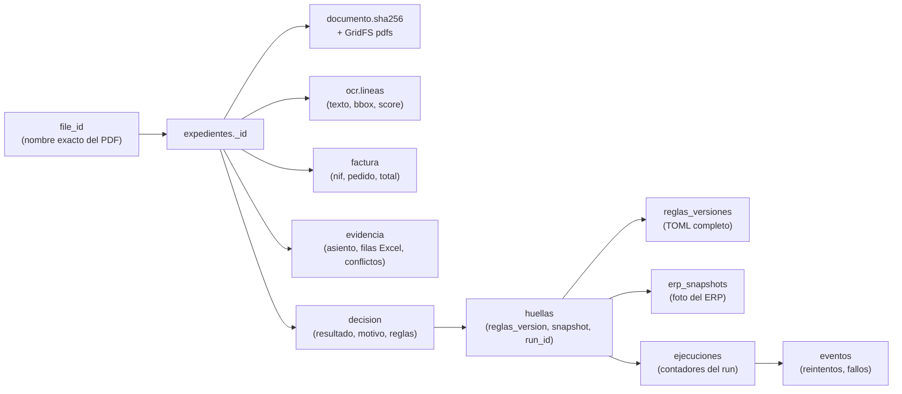

# Diseño Conceptual de la Base de Datos — Albertitos

> **Ámbito:** modelo conceptual (independiente de la tecnología) del almacén de datos
> del sistema de conciliación a tres bandas **PDF ↔ ERP ↔ Excel**.
> **Motor elegido:** MongoDB 7 (documental). La justificación está en el ADR del §3.
> **Documento hermano:** [`diseño_logico.md`](./diseño_logico.md) — traducción a
> colecciones, validadores `$jsonSchema`, índices y despliegue Docker.
>
> Referencias: [`albertitos_plan.md`](../albertitos_plan.md) (plan de entrega) y
> [`spec_y_plan.md`](../spec_y_plan.md) (especificación técnica interna).

---

## 1. Contexto y alcance

### 1.1 El problema de negocio

Alberto gestiona el pago de facturas de proveedor con tres fuentes de información
que **se contradicen entre sí**:

| Fuente | Naturaleza | Rol en la decisión | Fiabilidad |
|---|---|---|---|
| **ERP legado (2009)** | Bridge HTTP local, XML ISO-8859-1, 516 asientos | **Fuente de verdad contable.** Estado `PENDIENTE`/`PAGADA` por asiento | Alta (declarada oficial por el propio manual) |
| **Excel caótico** | `FINAL_v7_DEFINITIVO_ahorasi.xlsx`, esquema no documentado | **Contexto.** Complementa y a veces contradice al ERP | Media (informativa) |
| **PDFs de facturas** | 500 + 40 escaneados, sin estructura | **Entrada.** Origen de `nif`, `pedido`, `importe`, `fecha` | Baja (depende del OCR) |

El sistema debe producir, por cada PDF, una decisión **`PAGAR` / `NO_PAGAR` /
`ESCALAR`** con política conservadora (en la duda, `ESCALAR`), y debe poder
**reconstruir íntegramente** cómo se llegó a esa decisión.

### 1.2 Qué debe soportar la base de datos

1. **El pipeline operativo**: ingesta de ERP y Excel, extracción OCR, parseo,
   reconciliación, decisión y exportación a JSONL.
2. **La trazabilidad total**: cada decisión reconstruible de input a output
   (20 puntos de la rúbrica).
3. **La observabilidad**: contadores de reintentos por tipo de error del ERP
   (`ORA-00600`, `SES-401`, `ERP-429`), latencias por fase, distribución de
   resultados (20 puntos).
4. **La resiliencia**: reejecución idempotente, deduplicación entre lotes,
   reprocesado tras el escenario sorpresa del sábado (10 puntos).
5. **La evolución a 50 000 facturas** sin rediseño (25 puntos).

### 1.3 Fuera de alcance

- Sustituir al ERP: el sistema **lee** del ERP, nunca escribe en él.
- Almacenar el modelo de IA: el OCR es un servicio apátrida; aquí solo se
  persiste su **salida**.
- Analítica de negocio a largo plazo (BI): el diseño lo permite, pero no lo
  optimiza.

---

## 2. Requisitos no funcionales

| # | Requisito | Objetivo medible | Cómo lo cubre el diseño |
|---|---|---|---|
| RNF-1 | **Volumen inicial** | 540 expedientes (500 lote 1 + 40 lote 2) | Un documento por expediente; sin bucketing necesario |
| RNF-2 | **Volumen objetivo** | 50 000 expedientes/año | Shard key preparada (§11 del doc lógico) |
| RNF-3 | **Idempotencia** | Reprocesar un lote no duplica ni corrompe | `_id = file_id` + upsert; huellas de decisión |
| RNF-4 | **Reejecución tras cambio de reglas** | Detectar y reprocesar decisiones obsoletas | `decision.huellas.reglas_version` |
| RNF-5 | **Reejecución tras refetch del ERP** | Detectar decisiones tomadas con snapshot viejo | `decision.huellas.erp_snapshot_id` |
| RNF-6 | **Trazabilidad** | 100 % de decisiones reconstruibles | Documento embebido + `eventos` |
| RNF-7 | **Latencia de escritura** | 1 escritura atómica por expediente | Documento raíz embebido, sin transacciones |
| RNF-8 | **Coste** | 0 €/factura | Todo local; Mongo en Docker sobre el portátil |
| RNF-9 | **Auditoría** | Nada se borra salvo señales operativas | TTL solo en `eventos` (90 días) |
| RNF-10 | **Seguridad** | Mínimo privilegio, puerto no expuesto | Auth + usuario de app + bind a `127.0.0.1` |

### 2.1 Por qué la idempotencia es un requisito de primer nivel

El escenario del sábado 18:00 obliga a **reejecutar el lote 1** con reglas nuevas
y a **refetchear el ERP** con `--lote2`. Sin idempotencia, cada reejecución
duplicaría expedientes y contaminaría el JSONL de entrega. Con `_id = file_id`
y upserts, reejecutar es seguro por construcción.

---

## 3. ADR · Elección del motor de persistencia

### 3.1 Contexto

El sistema produce, por factura, un **agregado heterogéneo**: metadatos del
documento, salida cruda del OCR (array de líneas con bbox y score), campos
parseados, evidencia de reconciliación (asiento ERP + filas Excel + conflictos),
decisión con motivo y reglas evaluadas, y timings. Además necesita catálogos
compartidos (asientos, filas Excel, versiones de reglas) y un flujo de eventos
operativos.

### 3.2 Alternativas evaluadas

| Alternativa | Ventajas | Inconvenientes para este caso |
|---|---|---|
| **(a) PostgreSQL normalizado** | Integridad referencial fuerte, SQL maduro, `NUMERIC` exacto | El agregado del expediente se fragmenta en 6-8 tablas → 6-8 escrituras por factura o transacción larga; el OCR crudo (JSON variable) acaba en `JSONB` de todos modos; el esquema rígido penaliza el Excel caótico |
| **(b) Ficheros + índice** (`traces/` + SQLite) | Cero infraestructura, ya existe en el repo | Sin consultas cruzadas eficientes; la UI del bonus y las métricas requieren escanear el sistema de ficheros; sin atomicidad; sin TTL |
| **(c) MongoDB documental** | 1 documento = 1 expediente = 1 escritura atómica; esquema flexible para OCR y Excel; validadores `$jsonSchema` recuperan parte del contrato; time-series + TTL nativos para eventos; GridFS para los PDFs; change streams para la UI en vivo | Sin integridad referencial entre colecciones; requiere disciplina de validación en la aplicación |

### 3.3 Decisión

**Se elige (c) MongoDB**, con las siguientes compensaciones explícitas:

1. **La integridad referencial se sustituye por invariantes validados**:
   `$jsonSchema` con `oneOf` por estado del expediente garantiza que un
   expediente `COMPLETADA` **siempre** tiene decisión, y que `resultado` solo
   puede ser uno de los tres valores del contrato JSONL.
2. **El agregado se embebe** en un único documento raíz (`expedientes`), de modo
   que el camino crítico **no necesita transacciones multi-documento**. Esto es
   deliberado: el driver `mongodb 2.8` del proyecto es antiguo y las
   transacciones distribuidas añadirían latencia y complejidad sin beneficio.
3. **Los catálogos se referencian** (`asientos`, `excel_filas`, `reglas_versiones`)
   porque son compartidos, recargables y de cardinalidad muy distinta a la del
   expediente.
4. **Los contadores de ejecución se actualizan con `$inc` atómico** sobre un
   único documento de `ejecuciones`, evitando también aquí transacciones.

### 3.4 Consecuencias aceptadas

- Si un asiento del ERP se borra, el expediente conserva su copia embebida en
  `evidencia` → la decisión sigue siendo auditable aunque el catálogo cambie.
  **Esto es una ventaja, no un defecto**: la evidencia es una foto del momento
  de decidir.
- La aplicación debe validar antes de escribir; el validador es la red de
  seguridad, no la única defensa.
- Los importes se almacenan como `Decimal128` (no `double`) para evitar drift
  binario, coherente con `rust_decimal` en el binario Rust.

---

## 4. Entidades conceptuales

### 4.1 Glosario

| Entidad | Definición | Cardinalidad |
|---|---|---|
| **Lote** | Conjunto de facturas procesadas en una misma ejecución (lote 1, lote 2) | 1 lote → N expedientes |
| **Documento** | El PDF original y sus metadatos (nombre, hash, tamaño, páginas) | 1 documento → 1 expediente |
| **ExtracciónOCR** | Salida cruda del servicio OCR: líneas con texto, bbox y score | 1 extracción → 1 expediente |
| **FacturaParseada** | Campos extraídos del OCR. **Cada campo lleva su valor canónico y el texto del que salió** (ver `CampoExtraido`) | 1 factura → 1 expediente |
| **CampoExtraido** | Un campo con sus dos caras: el valor canónico, el crudo tal cual se leyó, la confianza y la ubicación exacta (`pág. 1 línea 8`, `Hoja1#42:D`, `asiento AS-412`). Su estado es `ENCONTRADO`, `NO_APARECE` o `ILEGIBLE` | 1 factura → 7 campos |
| **Asiento** | Registro contable del ERP: `asiento_id`, `nif`, `pedido`, `importe`, `estado` | 1 asiento → N expedientes (posible) |
| **SnapshotERP** | Foto completa de los asientos en un instante; permite detectar obsolescencia | 1 snapshot → N asientos |
| **FilaExcel** | Fila del Excel caótico, volcada sin pérdida como mapa de campos | 1 fila → N expedientes (posible) |
| **Evidencia** | Resultado de la reconciliación: asiento asociado, filas Excel, estrategia de match, conflictos | 1 evidencia → 1 expediente |
| **ReglaVersion** | Versión inmutable del fichero `reglas.toml` con su hash | 1 versión → N decisiones |
| **Decisión** | `PAGAR` / `NO_PAGAR` / `ESCALAR` + motivo + reglas evaluadas + huellas | 1 decisión → 1 expediente |
| **Run** | Ejecución del pipeline: contadores, latencias, estado | 1 run → N expedientes |
| **Evento** | Señal operativa puntual (reintento ERP, fallo OCR, cache hit) | 1 run → N eventos |
| **Revisión** | Intervención humana sobre un `ESCALAR` (bonus UI) | 1 revisión → 1 expediente |

> **Por qué cada campo guarda el crudo y el normalizado.** El sistema toma cada
> dato dos veces: el texto tal cual lo entregó la fuente y el valor canónico en
> que se convirtió (`"b-12345678"` → `"B12345678"`, `"1.234,50 EUR"` →
> `Decimal("1234.50")`, `"02/09/2024"` → `"2024-09-02"`). Si solo se guardara el
> canónico, una decisión mala sería **indistinguible** de un OCR malo, de una
> normalización mala o de una regla mala: los tres caminos terminan en el mismo
> valor, y no habría forma de saber en qué paso se torció la cosa. Con el crudo
> al lado, la traza se convierte en diagnóstico, y quien revise un `ESCALAR` ve
> exactamente el texto que se leyó y **de dónde salió** (página y línea del OCR,
> celda del Excel, asiento del ERP) sin volver a ejecutar el pipeline.
>
> El estado del campo no es un booleano: `NO_APARECE` (el PDF no trae el dato) e
> `ILEGIBLE` (se leyó algo que no se pudo canonizar) son casos distintos y llevan
> a decisiones distintas — lo primero se puede conciliar por pedido, lo segundo
> obliga a escalar, porque no se puede garantizar *a quién* se está pagando.

### 4.2 Diagrama entidad-relación

### 4.3 Nota sobre el diagrama

Las relaciones marcadas como **"embebe"** no son relaciones entre colecciones:
son **subdocumentos** dentro del documento `EXPEDIENTE`. Se dibujan como
entidades porque conceptualmente lo son, y porque el modelo lógico las valida
por separado con `$jsonSchema`. Las marcadas como **"referencia"** sí son
relaciones entre colecciones, resueltas por `_id` en tiempo de consulta.

---

## 5. Ciclo de vida del expediente

### 5.1 Máquina de estados

### 5.2 Invariantes de negocio

Estos invariantes son **contratos del modelo de datos**, no solo reglas de
aplicación. El diseño lógico los hace cumplir con `$jsonSchema`.

| # | Invariante | Consecuencia si se viola |
|---|---|---|
| INV-1 | `resultado ∈ {PAGAR, NO_PAGAR, ESCALAR}` | El JSONL de entrega sería inválido → descalificación |
| INV-2 | Si `estado_proceso = COMPLETADA` entonces existe `decision` | Decisión no auditable |
| INV-3 | Si `estado_proceso ≠ COMPLETADA` entonces **no** existe `decision` | Decisión prematura, no reproducible |
| INV-4 | `resultado = PAGAR` ⟹ existe `evidencia.asiento_id` con estado `PENDIENTE` | Pago sin respaldo contable |
| INV-5 | `resultado = NO_PAGAR` ⟹ existe `evidencia.asiento_id` con estado `PAGADA` **o** duplicado detectado | Bloqueo de pago legítimo |
| INV-6 | `resultado = ESCALAR` ⟹ `motivo` no vacío | Escalado sin explicación para el operador |
| INV-7 | `huella_negocio = nif|pedido` es **no única** por diseño | Un duplicado es un caso de negocio legítimo (→ `NO_PAGAR`), no un error de datos |
| INV-8 | Todo importe es `Decimal128`, nunca `double` | Drift binario en conciliaciones de ±0,01 € |
| INV-9 | `decision.huellas` referencia `reglas_version`, `erp_snapshot_id` y `run_id` | Imposible detectar decisiones obsoletas |
| INV-10 | Un expediente `COMPLETADA` es inmutable salvo `revision` | Pérdida de la traza original |

### 5.3 Por qué INV-7 es contraintuitivo y correcto

La tentación es declarar `(nif, pedido)` como clave única. **Es un error de
modelado**: el plan de entrega (§1) define explícitamente que `NO_PAGAR`
"también cubre **duplicados** y rectificativas explícitas". Es decir, dos
facturas con el mismo `(nif, pedido)` son un **caso de negocio esperado** que
debe producir `NO_PAGAR`, no un conflicto de integridad que deba rechazarse.
Por eso `huella_negocio` lleva un índice **no único**, y la detección de
duplicados es lógica de reconciliación, no una restricción de la base de datos.

---

## 6. Política de datos

### 6.1 Qué se versiona (inmutable, nunca se sobrescribe)

| Dato | Motivo |
|---|---|
| **Versiones de reglas** (`reglas_versiones`) | La regla nueva del sábado debe quedar registrada con su hash; una decisión debe poder explicarse con la versión vigente en su momento |
| **Snapshots del ERP** (`erp_snapshots`) | El ERP cambia con `--lote2`; una decisión tomada con el snapshot anterior debe poder identificarse como obsoleta |
| **Evidencia embebida** | Es una foto del momento de decidir; si el catálogo cambia, la decisión sigue siendo auditable |

### 6.2 Qué caduca (TTL)

| Dato | Retención | Motivo |
|---|---|---|
| **Eventos operativos** (`eventos`) | 90 días | Son señales de observabilidad, no evidencia contable. A 50 000 facturas/año, sin TTL la colección crecería sin límite |

### 6.3 Qué se conserva indefinidamente

Todo lo demás: expedientes, documentos (GridFS), asientos, filas Excel,
ejecuciones, revisiones. El volumen a 540 expedientes es trivial (~54 MB de
documentos + ~110 MB de PDFs) y a 50 000 sigue siendo manejable.

### 6.4 Qué se puede regenerar (derivados)

`outputs/outcomes.jsonl`, `outputs/outcomes_lote2.jsonl` y `traces/` **no son
fuentes de verdad**: son **exportaciones** derivadas de MongoDB. Esto es un
cambio de arquitectura respecto al plan original (donde `traces/` era el
almacén primario) y tiene una consecuencia importante: **el JSONL de entrega
se genera con una consulta ordenada por `_id`**, lo que garantiza una línea por
factura, sin duplicados y sin líneas vacías (checklist del §5 del plan).

---

## 7. Modelo de consistencia

### 7.1 Dónde basta la atomicidad de un documento

El **camino crítico** (una factura → una decisión) cabe entero en un documento
`expedientes`. Un `updateOne` con `upsert: true` sobre `_id = file_id` es
atómico por definición en MongoDB. **No se necesitan transacciones.**

### 7.2 Dónde no basta (y cómo se resuelve sin transacciones)

| Operación | Riesgo | Solución adoptada |
|---|---|---|
| Contadores de un run | Lost update si dos workers incrementan a la vez | `$inc` atómico sobre un único documento de `ejecuciones` |
| Ingesta de 516 asientos | Escritura parcial si el proceso muere | `bulkWrite` con `ordered: false` + flag `vigente`; el snapshot se marca vigente **al final**, cuando está completo |
| Refetch del ERP | Decisiones tomadas con snapshot viejo | Bitemporalidad mínima: `decision.huellas.erp_snapshot_id` permite consultar las obsoletas |
| Cambio de reglas | Decisiones tomadas con reglas viejas | `decision.huellas.reglas_version` permite consultar las obsoletas |

### 7.3 Nivel de consistencia elegido

- **Lecturas**: `readConcern: "local"` (suficiente; no hay lecturas que crucen
  documentos en el camino crítico).
- **Escrituras**: `writeConcern: { w: "majority" }` en `expedientes` y
  `reglas_versiones` (evidencia contable); `w: 1` en `eventos` (señales
  operativas, se pueden perder sin consecuencias).
- **Replica set de 1 nodo**: habilita change streams (UI en vivo) y es el
  requisito para poder escalar a réplica real sin cambiar la cadena de conexión.

---

## 8. Seguridad y despliegue (conceptual)

| Control | Decisión |
|---|---|
| **Autenticación** | Habilitada; usuario administrador para init, usuario de aplicación con rol `readWrite` **solo** sobre `albertitos` |
| **Mínimo privilegio** | El usuario de app no puede tocar `admin` ni otras bases de datos |
| **Exposición de red** | Puerto publicado **solo en `127.0.0.1`**; nunca `0.0.0.0` |
| **Persistencia** | Volumen nombrado de Docker; sobrevive a `down`/`up` |
| **Credenciales** | Fuera del control de versiones (`.env`, ignorado por git); `.env.example` documenta las variables |
| **Salud** | Healthcheck con `rs.status().ok == 1`; el pipeline no arranca hasta que el contenedor está `healthy` |
| **Replica set** | `rs0` de 1 nodo, iniciado por script idempotente **fuera** de la fase de initdb (ver `diseño_logico.md` §13.4) |
| **Secreto interno del replica set** | Un replica set exige autenticación **entre miembros** además de la de clientes; el motor recibe un secreto compartido generado en el arranque, no versionado (ver `diseño_logico.md` §13.3) |

---

## 9. Trazabilidad: la cadena input → output

El criterio de 20 puntos exige que **cada decisión sea reconstruible**. La
cadena completa, partiendo de un `file_id`:

**Lectura de la cadena:** dado un `file_id`, se obtiene el documento del
expediente; de ahí, el PDF original (por hash, en GridFS), el texto que el OCR
leyó, los campos que el parser extrajo, el asiento del ERP y las filas del Excel
que se cruzaron, la decisión con su motivo, y —vía las huellas— la versión
exacta de las reglas, la foto del ERP y la ejecución en la que se tomó. **Nada
queda implícito.**

---

## 10. Resumen de decisiones de diseño

| # | Decisión | Alternativa descartada | Motivo |
|---|---|---|---|
| D-1 | MongoDB documental | PostgreSQL normalizado | 1 escritura atómica por expediente; esquema flexible para OCR/Excel |
| D-2 | Documento raíz `expedientes` con subdocumentos embebidos | Colecciones separadas por fase | Evita transacciones en el camino crítico |
| D-3 | `_id = file_id` | ObjectId autogenerado | Idempotencia natural y trazabilidad directa desde el nombre del PDF |
| D-4 | `Decimal128` para importes | `double` | Exactitud en tolerancias de ±0,01 € |
| D-5 | `huella_negocio` con índice **no único** | Clave única `(nif, pedido)` | Los duplicados son un caso de negocio (→ `NO_PAGAR`) |
| D-6 | Bitemporalidad mínima vía `decision.huellas` | Sin versionado | Permite detectar decisiones obsoletas tras `--lote2` o cambio de reglas |
| D-7 | `eventos` como time-series con TTL 90 días | Colección normal sin TTL | Métricas con una sola agregación; crecimiento acotado |
| D-8 | Contadores con `$inc` atómico | Transacciones | Compatible con el driver antiguo; sin latencia extra |
| D-9 | PDFs en GridFS | Sistema de ficheros | Un único almacén operativo; backup y restauración coherentes |
| D-10 | JSONL y `traces/` como exportaciones derivadas | Almacén primario | Una sola fuente de verdad; el JSONL se regenera siempre consistente |
| D-11 | Replica set de 1 nodo | Standalone | Habilita change streams y prepara el escalado sin cambiar la URI |
| D-12 | Puerto solo en `127.0.0.1` | `0.0.0.0` | El ERP y el OCR son locales; no hay motivo para exponer la BD |