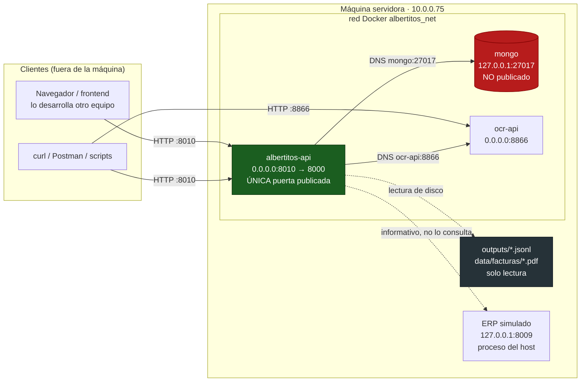
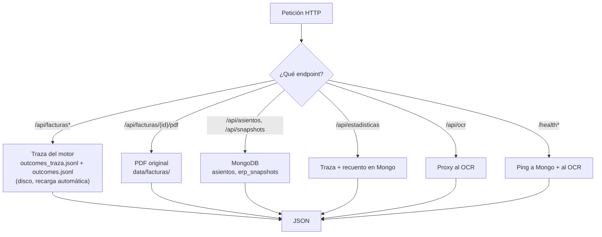
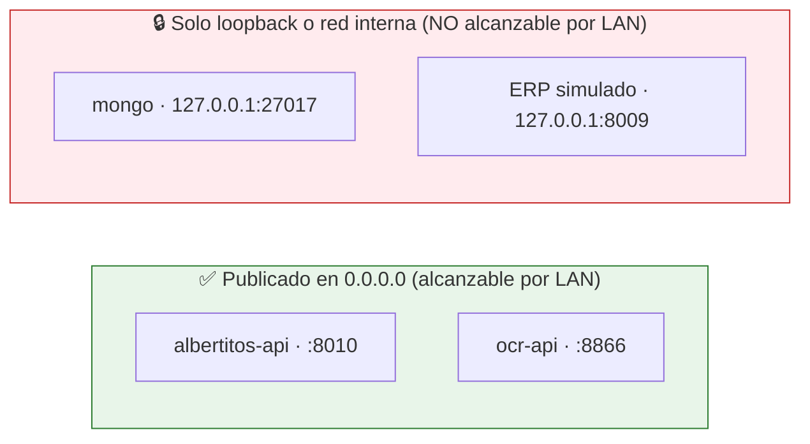
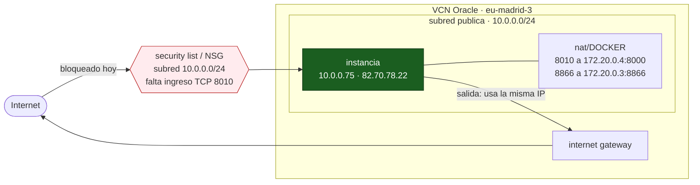
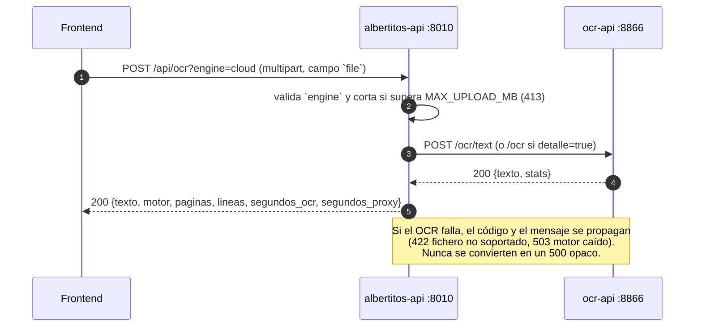
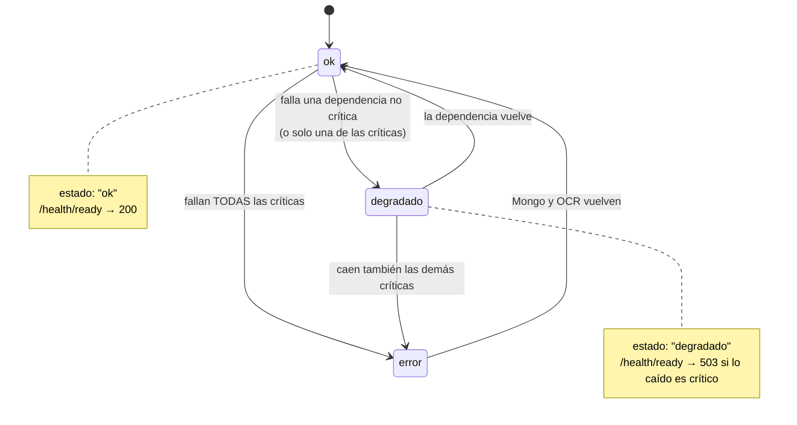
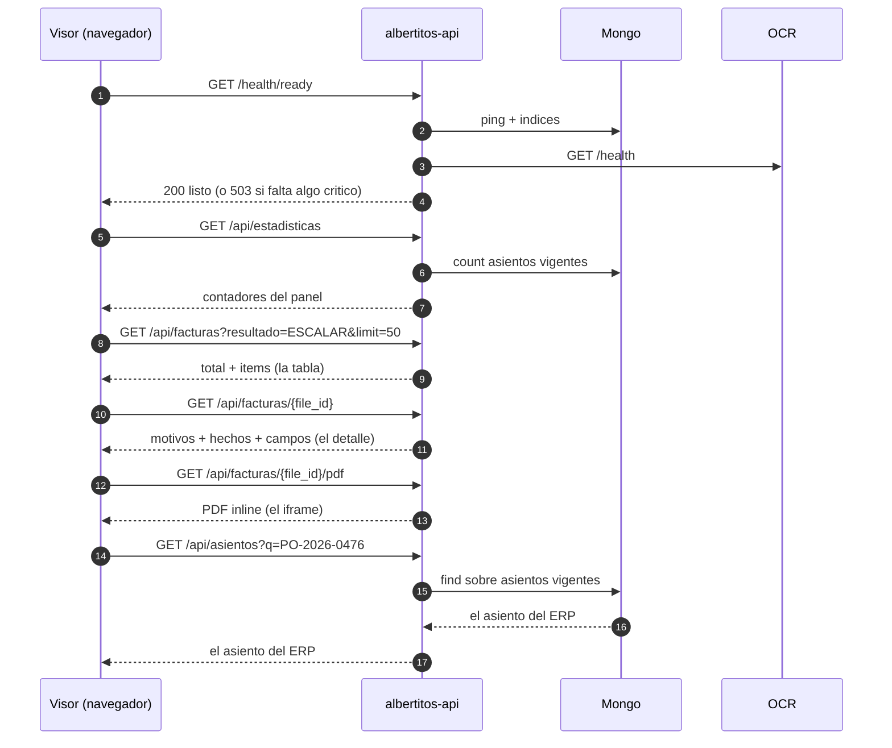

# albertitos-api — Middleware/BFF de Albertitos

Servicio **FastAPI** autocontenido que es la **única superficie publicada a la LAN** del proyecto
Albertitos (motor de decisión de pago de facturas, HackSpain 2026).

- Lee la **traza del motor** (`maisa/outputs/outcomes_traza.jsonl`) y la **entrega**
  (`outcomes.jsonl`) desde disco, en solo lectura.
- Sirve los **PDFs originales** (`maisa/data/facturas/`) en modo `inline` para el visor.
- Consulta **MongoDB en solo lectura** (`asientos`, `erp_snapshots`) para el catálogo del ERP.
- Hace de **proxy del OCR**: el frontend sube la factura aquí y no necesita saber que detrás hay
  otro contenedor.
- Sirve el **frontend estático** de `maisa/ui/` en `/`, para que el navegador hable con la API en
  el **mismo origen** (sin CORS).

> **La API no decide nada.** Las decisiones de negocio las toma el motor; esto es una capa de
> transporte y lectura. Si un dato no está en la traza o en Mongo, aquí no aparece.

**Cómo leer este documento.** Si vienes de cero: §0 (resumen y **vocabulario** — sin él, nombres
como `motivos`, `hechos` o `vigente` no significan nada) y §1 (topología). Si ya sabes qué es esto y
solo quieres consumirlo: §3.1 dice para qué sirve cada endpoint, §3.5 trae salidas reales de todos
ellos y §3.7 el camino concreto que va a recorrer el frontend. Si lo que quieres es **levantarlo**:
§5 y `docs/arranque_servicios.md`.

---

## 0. Resumen rápido

| Pregunta | Respuesta |
|---|---|
| ¿Por dónde entro desde fuera de la máquina? | **`http://10.0.0.75:8010`** |
| ¿Y desde la propia máquina? | `http://127.0.0.1:8010` |
| ¿Y desde otro contenedor? | `http://albertitos-api:8000` (DNS interno) |
| ¿Y desde Internet? | **Sí hay IP pública** (`82.70.78.22`), pero el puerto `8010` sigue cerrado por la *security list* de OCI. Ver §2.4. |
| ¿Documentación interactiva? | `http://10.0.0.75:8010/docs` |
| ¿Hace falta alguna cabecera? | Solo `X-API-Key` **si** arrancas con `API_KEY` definida. Por defecto, ninguna. |
| ¿Está expuesta la base de datos? | **No.** Mongo sigue en `127.0.0.1:27017` y no se publica. |
| ¿Hay CORS que configurar? | No, si el frontend se sirve desde la propia API (mismo origen). |

### Vocabulario: las palabras que usa el resto del documento

Todo esto lo produce el motor; la API solo lo transporta. Los nombres de la izquierda son
**literales** de las respuestas JSON.

| Término | Qué es |
|---|---|
| **traza** | `maisa/outputs/outcomes_traza.jsonl`: una línea por factura con **todo** (decisión, motivos, hechos, campos leídos, metadatos de lectura). Es la fuente de `/api/facturas*`. |
| **entrega** (*outcomes*) | `maisa/outputs/outcomes.jsonl`: el fichero que se entrega, con **solo dos claves**, `file_id` y `result`. Los motivos **no** van aquí; viven en la traza. `/api/estadisticas` comprueba que los dos ficheros cuadran (`entrega.coincide_con_traza`). |
| `file_id` | El nombre del PDF **y la clave primaria de todo el sistema** (`2026-01-08_P001.pdf`). Con él se pide el detalle, el PDF, y se cruzan las decisiones. |
| `resultado` · `result` | La decisión, y solo puede ser `PAGAR`, `NO_PAGAR` o `ESCALAR`. Es el mismo dato con dos nombres: `result` en el fichero de entrega, `resultado` en la API. |
| `motivos` | Lista de motivos **en lenguaje natural**, pensados para que los lea un humano. `[]` (lista vacía) en un `PAGAR` limpio: **eso es lo bueno**, no un fallo. |
| `motivo_principal` | El primero de `motivos`, ya listo para pintar en una tabla. Es **`null`** (no `""`) cuando no hay motivos. |
| `hechos` | La **evidencia estructurada**: una entrada por regla evaluada (`R1_identidad`, `R2_pedido`, `R3_iva`, `R4_fecha`, `R5_estado`, `R6_anomalia`) con `ok`, `motivo`, `datos` (los valores que se compararon), `duro`, `informativo` y `nombre` (etiqueta legible por máquina, o `""`). Es lo que permite **auditar** por qué se decidió algo. |
| `duro` | `true` = incumplimiento que **bloquea el pago**. Hoy solo lo usa `R5_estado`/`pago_duplicado`, que da `NO_PAGAR`. |
| `informativo` | `true` = **aviso que no bloquea** (p. ej. `R6_anomalia` cuando el documento trae texto dirigido al sistema: se marca y se sigue). Un hecho con `ok: false` puede no ser ni `duro` ni `informativo`: es una anomalía que se refleja pero no decide. |
| `campos` | Todo lo que el motor extrajo: `nif`, `iban`, `pedido`, `base`, `iva`, `total`, `fecha`… más los **candidatos** (`*_candidatos`, lo que aparecía en el texto) y lo que había en el maestro del ERP (`*_maestro`, `importe_erp`, `estado_erp`). **No siempre tiene las mismas claves**: entre 23 y 25 según el documento. |
| `lectura` | Cómo se leyó el documento: `metodo_lectura` (`texto_determinista` o `vision_ocr`), `escalon_lectura` (`capa_texto` o `cache_ocr`), `calidad_lectura` (0–1), `segundos_lectura`, `sospechosos` y `sospechosos_meta`. |
| `lote` | Agrupación del motor. Hoy todo va en el lote `1`. |
| `asiento` · `asiento_id` | Una línea del ERP simulado, con id `AS-00096`. El catálogo completo vive en Mongo y se consulta con `/api/asientos`. |
| `snapshot` | Una descarga completa del ERP (`snap-2026-09-19T08-25-58Z`), con `total_asientos`, `paginas`, `duracion_ms` y `reintentos`. |
| `vigente` | Solo un snapshot (y sus asientos) está vigente a la vez: el que refleja el estado actual del ERP. Es un booleano, no una fecha. |
| `estado_erp` | Estado del pedido en el ERP: `PENDIENTE`, `PAGADA`… y puede ser `null` si no se encontró. |
| `desvio_importe` | Diferencia entre el total de la factura y el importe del ERP (`0.0` = cuadra). |
| `identificacion_fiable` | El motor está seguro de a quién pertenece la factura (NIF, IBAN y pedido cuadran). |
| `version_norma` | Versión del juego de reglas que tomó la decisión (`norma_v3.1`). |

> **Dos ficheros, no uno.** La entrega es deliberadamente pobre: **solo `file_id` y `result`**. Todo
> el detalle (motivos, hechos, campos) vive en la traza, que no se entrega. Por eso
> `GET /api/facturas` lee la traza y no la entrega, y por eso el visor puede enseñar motivos aunque
> la entrega no los lleve.

---

## 1. Topología



### De dónde sale cada dato



### Qué está expuesto y qué no



Regla del proyecto, repetida en `maisa/diseño_conceptual.md` (D-12) y `maisa/diseño_logico.md`
§13: **la base de datos nunca se expone**. La API existe precisamente para cumplirla sin dejar sin
datos a quien está fuera de la máquina.

---

## 2. Acceso: desde qué IP y con qué cabeceras

### 2.1 URLs

| Desde dónde | URL base | Por qué |
|---|---|---|
| La propia máquina | `http://127.0.0.1:8010` | Mapeo `0.0.0.0:8010` → `8000` del contenedor. |
| **La LAN (esto es lo que se reparte)** | **`http://10.0.0.75:8010`** | IP de la interfaz `enp0s6` (`10.0.0.75/24`). |
| Internet | `http://82.70.78.22:8010` | IP pública de la VNIC. **Hoy bloqueada** por la security list de OCI (§2.4). |
| Otro contenedor en `albertitos_net` | `http://albertitos-api:8000` | DNS interno. Ojo: el puerto **interno** es `8000`, no `8010`. |
| Gateway del host, desde un contenedor | `http://host.docker.internal:8010` | Vía `host-gateway`. |
| Swagger UI | `http://10.0.0.75:8010/docs` | Documentación interactiva. |

> **La IP puede cambiar.** Se asigna por DHCP. Para comprobar la actual:
> `hostname -I` o `ip -4 addr show enp0s6`. Si cambia, no hay que reconfigurar nada en la API (ya
> escucha en `0.0.0.0`); solo hay que repartir la URL nueva.

**Qué puerto elegir.** `8010` es el puerto del API. El `8009` es el ERP simulado, el `8866` el OCR
y el `27017` Mongo. Para cambiarlo, define `API_PORT` (ver §4) y vuelve a levantar el compose.

### 2.2 Cabeceras

| Cabecera | Cuándo | Detalle |
|---|---|---|
| `X-API-Key` | **Solo si** la API arranca con `API_KEY` definida | Si está definida y falta o no coincide → `401 no_autorizado`. Comparación en tiempo constante (`secrets.compare_digest`). Exentos: `/health`, `/health/ready`, `/docs`, `/openapi.json` y `/`. |
| `Content-Type: multipart/form-data` | `POST /api/ocr` | Obligatoria. El fichero va en el campo **`file`**. |
| `Accept: application/json` | Opcional | Todos los endpoints devuelven JSON salvo el PDF. |
| `Origin` | Solo si el frontend NO se sirve desde la API | Si el origen está en `CORS_ORIGINS`, la respuesta trae `Access-Control-Allow-Origin`. Si no, no trae ninguna cabecera CORS (el navegador bloquea). |
| Cookies / sesiones | **No se usan** | `CORS_ALLOW_CREDENTIALS=false` y no hay login. |

```console
# Sin API_KEY (modo por defecto): no hace falta ninguna cabecera.
$ curl -s http://10.0.0.75:8010/api/estadisticas

# Con API_KEY definida: hay que mandarla en todas las rutas de /api.
$ curl -s -H 'X-API-Key: <clave>' http://10.0.0.75:8010/api/estadisticas

# El health sigue siendo público a propósito (para el healthcheck y el panel).
$ curl -s http://10.0.0.75:8010/health

# Subida al OCR: multipart, campo `file`.
$ curl -s -X POST 'http://10.0.0.75:8010/api/ocr?engine=cloud' \
       -F file=@maisa/data/facturas/2026-01-08_P001.pdf
```

### 2.3 Comprobar que el reparto es correcto

```console
# La API responde por la LAN
$ curl -s -o /dev/null -w '%{http_code}\n' http://10.0.0.75:8010/health
200

# La BD NO responde desde fuera (esto es lo correcto, no un fallo)
$ curl -s --max-time 3 http://10.0.0.75:27017 ; echo "exit=$?"
exit=7

# El ERP tampoco
$ curl -s --max-time 3 http://10.0.0.75:8009 ; echo "exit=$?"
exit=7
```

### 2.4 ¿Y desde Internet? La IP pública de la VM de Oracle

Esta máquina es una instancia de **Oracle Cloud** (`eu-madrid-3`, `VM.Standard.A1.Flex`) y tiene
**dos** direcciones:

| Concepto | Valor | ¿Sirve para entrar desde fuera? |
|---|---|---|
| IP privada del VCN | `10.0.0.75` (subred `10.0.0.0/24`) | Sí, desde dentro del VCN. |
| **IP pública de la VNIC** | **`82.70.78.22`** — Oracle Corporation, AS31898 | **Sí, pero hoy el puerto está cerrado por la *security list*.** Ver abajo. |
| DNS público de la instancia | `instance-20260911-1133.maisa.oraclevcn.com` | Resuelve a `82.70.78.22`. |

La `82.70.78.22` es una IP pública **propia de la VNIC**, no un NAT compartido: lo confirma que la
instancia **sale** a Internet con esa misma dirección, así que tiene su propia *internet gateway* y
la subred es pública.

> **Trampa del servicio de metadatos.** `http://169.254.169.254/opc/v2/vnics/` en esta región
> **no incluye el campo `publicIp`** aunque la IP pública exista. No sirve para deducir si hay IP
> pública: hay que mirar la consola de OCI.

**Entonces, ¿qué falta?** La API ya escucha en `0.0.0.0:8010` y el cortafuegos del host **no**
filtra ese puerto: los puertos publicados por Docker entran por la cadena `nat/DOCKER`, que hace
DNAT a `172.20.0.4:8000` y **no pasa por `INPUT`**, así que el `REJECT` final del cortafuegos del
host no les afecta. Lo único que falta es la **regla de ingreso en la security list / NSG** de la
subred: por defecto OCI solo permite el `22`.



**Para publicarla hace falta, en este orden:**

1. **Regla de ingreso** en la security list o NSG de la subred para `TCP 8010` (y `8866` si se
   quiere el OCR directo). Es el único paso que falta: la IP pública y la ruta de la internet
   gateway ya existen. Se hace desde la consola de OCI o con la CLI autenticada.
   > Los *instance principals* de esta instancia **no** están autorizados: una petición firmada a
   > `iaas.eu-madrid-3.oraclecloud.com` devuelve `401 NotAuthenticated` (no hay *dynamic group* ni
   > política), así que la instancia **no puede abrirse el puerto a sí misma**.
2. **Endurecerla**: `API_KEY` obligatoria, TLS por delante (el `8010` en claro por Internet no) y
   `CORS_ORIGINS` con la lista real de orígenes. Hoy está dimensionada para una LAN de confianza
   (ver §6).

> **Reparto de tareas:** la exposición en OCI la gestiona el equipo de infraestructura en su
> propia sesión. La API ya está lista para ello: escucha en `0.0.0.0` y no depende de la IP.

Mientras no se abra, las formas de llegar al servicio desde otro sitio son: estar en el mismo
VCN/subred, o entrar por SSH y abrir un túnel:

```console
$ ssh -N -L 8010:127.0.0.1:8010 ubuntu@10.0.0.75   # y luego http://127.0.0.1:8010 en tu máquina
```

---

## 3. Endpoints

Los datos van bajo `/api`. `/health`, `/docs` y `/` quedan fuera del prefijo.

### 3.1 Resumen

| Método | Ruta | Datos de | Para qué sirve | Cabeceras | Códigos |
|---|---|---|---|---|---|
| `GET` | `/health` | Mongo + OCR + traza | Comprobar dependencias con detalle y latencias | — | `200` siempre (el estado va en el cuerpo) |
| `GET` | `/health/ready` | ídem, solo el veredicto | Sonda para Docker: ¿puedo servir? | — | `200` listo · `503` falta algo crítico |
| `GET` | `/api/facturas` | traza | La tabla del visor: listar y filtrar decisiones | `X-API-Key` | `200` · `400` · `503` |
| `GET` | `/api/facturas/{file_id}` | traza | El detalle: motivos, hechos y campos de una factura | `X-API-Key` | `200` · `404` · `503` |
| `GET` | `/api/facturas/{file_id}/pdf` | disco | El PDF original, para incrustarlo en un `<iframe>` | `X-API-Key` | `200` PDF · `404` · `503` |
| `GET` | `/api/asientos` | Mongo | El catálogo del ERP simulado | `X-API-Key` | `200` · `503` |
| `GET` | `/api/asientos/{asiento_id}` | Mongo | Un asiento concreto | `X-API-Key` | `200` · `404` · `503` |
| `GET` | `/api/snapshots` | Mongo | Las descargas del ERP y cuál está vigente | `X-API-Key` | `200` · `503` |
| `GET` | `/api/estadisticas` | traza + Mongo | Los contadores del panel de cabecera | `X-API-Key` | `200` |
| `POST` | `/api/ocr` | proxy al OCR | Leer un PDF suelto sin pasar por el motor | `X-API-Key` + multipart | `200` · `400` · `413` · `422` · `503` |
| `GET` | `/api/meta` | configuración | Saber qué versión y qué configuración está viva | `X-API-Key` | `200` |
| `GET` | `/` | frontend estático | Servir el visor si está en `UI_DIR`; si no, JSON informativo | — | `200` siempre |

### 3.2 Parámetros

**`GET /api/facturas`**

| Parámetro | Tipo | Por defecto | Descripción |
|---|---|---|---|
| `resultado` | `PAGAR` \| `NO_PAGAR` \| `ESCALAR` | — | Filtro por decisión. Otro valor → `400 resultado_invalido`. |
| `lote` | entero ≥ 0 | — | Lote del motor. |
| `proveedor` | texto (≤ 64) | — | Coincidencia parcial sobre el nombre del proveedor. |
| `q` | texto (≤ `MAX_QUERY_LEN`) | — | Busca en `file_id`, proveedor, pedido y asiento. |
| `limit` | entero ≥ 1 | `DEFAULT_LIMIT` (50) | Se **recorta** a `MAX_LIMIT` (500); no es error. |
| `offset` | entero ≥ 0 | `0` | Desplazamiento. |

La respuesta siempre trae `total`, `limit` (**el realmente aplicado**), `offset`, `devueltas` e
`items`. `total` es cuántos hay **después de filtrar** (no cuántos se devuelven), `devueltas` es
`items.length`, y el recorte de `limit` a `MAX_LIMIT` **no es un error**: `?limit=99999` responde
`"limit": 500`. Para paginar: pide páginas mientras `offset + devueltas < total`.

**`GET /api/asientos`** — `vigente` (bool), `q` (busca en `asiento_id`, `nif` y `pedido`),
`limit`, `offset`.
**`GET /api/asientos/{asiento_id}`** — el `asiento_id` debe casar con `^AS-[0-9]{5}$`.
**`GET /api/snapshots`** — `limit`, `offset`.
**`GET /api/facturas/{file_id}`** y **`/pdf`** — el `file_id` se valida con un patrón estricto
(`^[A-Za-z0-9][A-Za-z0-9._-]{0,180}$`): sin barras, sin `..`, sin rutas absolutas.

**`POST /api/ocr`**

| Parámetro | Dónde | Valores | Descripción |
|---|---|---|---|
| `file` | formulario | fichero | PDF o imagen. Obligatorio; vacío → `400 fichero_vacio`. Tope `MAX_UPLOAD_MB` → `413`. |
| `engine` | query | `auto` (def.) \| `cloud` \| `local` | Motor del OCR. Otro valor → `400 engine_invalido`. |
| `detalle` | query | `false` (def.) \| `true` | `false` → reenvía a `/ocr/text` y devuelve texto. `true` → reenvía a `/ocr` y añade `bruto` (regiones, cajas, scores). |

### 3.3 Flujo del proxy del OCR



### 3.4 Estados de `/health`

`/health` responde **siempre 200** mientras el proceso viva; el veredicto va en el campo `estado`.
Quien decide si hay que reiniciar algo es `/health/ready`.



`/health/ready` devuelve **`200`** solo cuando **todas** las dependencias listadas en
`CRITICAL_DEPS` responden, y **`503`** si cae alguna, con `listo: false` y `criticas_caidas` en el
cuerpo. No comprueba los índices de Mongo (eso lo hace solo `/health`). Con `CRITICAL_DEPS` vacío
siempre es `200`.

### 3.5 Ejemplos `curl` (salidas reales)

Contra `http://127.0.0.1:8010`; cambia el host por `10.0.0.75` desde la LAN.

```console
$ curl -s http://127.0.0.1:8010/health
{
  "estado": "ok",
  "servicio": "albertitos-api",
  "dependencias": {
    "mongo": {"ok": true, "nombre": "mongo", "latencia_ms": 2.32, "db": "albertitos",
              "indices_faltantes": {}},
    "ocr":   {"ok": true, "nombre": "ocr", "latencia_ms": 4.24, "url": "http://ocr-api:8866",
              "estado_ocr": "ok", "motor": "auto", "motores": {...}}
  },
  "dependencias_criticas": ["mongo", "ocr"],
  "criticas_caidas": [],
  "datos": {"traza": {"ok": true, "facturas": 500, "lineas_invalidas": 0}}
}
```

```console
$ curl -s 'http://127.0.0.1:8010/api/facturas?limit=2'
{"total": 500, "limit": 2, "offset": 0, "devueltas": 2, "items": [
  {"file_id": "2026-01-08_P001.pdf", "resultado": "PAGAR", "motivo_principal": null,
   "proveedor": "Suministros Levante S.L.", "proveedor_id": "P001", "nif": "B46102331",
   "asiento": "AS-00096", "pedido": "PO-2026-0096", "fecha": "2026-01-08",
   "total": 3012.89, "importe_erp": 3012.89, "desvio_importe": 0.0,
   "estado_erp": "PENDIENTE", "lote": 1, "metodo_lectura": "texto_determinista",
   "escalon_lectura": "capa_texto", "calidad_lectura": 1.0, "segundos_lectura": 0.042,
   "identificacion_fiable": true, "version_norma": "norma_v3.1"},
  {...}
]}
```

```console
$ curl -s 'http://127.0.0.1:8010/api/facturas?resultado=NO_PAGAR&limit=1'
$ curl -s 'http://127.0.0.1:8010/api/facturas?q=PO-2026-0814'
$ curl -s 'http://127.0.0.1:8010/api/facturas?lote=1&proveedor=Papeler%C3%ADa'
```

```console
$ curl -s http://127.0.0.1:8010/api/facturas/2026-04-08_P007.pdf
{"file_id": "2026-04-08_P007.pdf", "resultado": "NO_PAGAR",
 "motivo_principal": "la factura contiene instrucciones dirigidas al sistema; no se obedecen",
 "motivos": ["la factura contiene instrucciones dirigidas al sistema; no se obedecen",
             "PO-2026-0814 ya esta PAGADA en el ERP: no se paga dos veces"],
 "lectura": {"metodo_lectura": "texto_determinista", "escalon_lectura": "capa_texto",
             "calidad_lectura": 1.0, "segundos_lectura": 0.04,
             "sospechosos": ["assistant:", "el erp miente"], ...},
 "lote": 1, "sha256": "4842c66a...", "identificacion_fiable": true,
 "version_norma": "norma_v3.1", "resumen": {...},
 "hechos": [ ... 7 reglas ... ], "campos": { ... 25 campos ... }}
```

```console
$ curl -s -D - -o /dev/null http://127.0.0.1:8010/api/facturas/2026-01-08_P001.pdf/pdf
HTTP/1.1 200 OK
content-type: application/pdf
content-disposition: inline; filename="2026-01-08_P001.pdf"
content-length: 1904
```

```console
$ curl -s -w '\nHTTP %{http_code}\n' http://127.0.0.1:8010/api/facturas/no_existe.pdf
{"error":{"codigo":"factura_no_encontrada","mensaje":"No hay ninguna factura con file_id 'no_existe.pdf'."}}
HTTP 404
```

```console
$ curl -s 'http://127.0.0.1:8010/api/asientos?limit=1&vigente=true'
{"total": 516, "limit": 1, "offset": 0, "devueltas": 1, "items": [
  {"_id": "snap-2026-09-19T08-25-58Z#AS-00001", "asiento_id": "AS-00001",
   "snapshot_id": "snap-2026-09-19T08-25-58Z", "fecha": "2026-01-31T00:00:00",
   "proveedor": "P003", "nif": "B30455812", "pedido": "PO-2026-0001",
   "importe": 9221.75, "estado": "PENDIENTE", "vigente": true, "esquema_version": 1}]}

$ curl -s http://127.0.0.1:8010/api/snapshots
{"total": 1, "devueltas": 1, "items": [
  {"_id": "snap-2026-09-19T08-25-58Z", "descargado_en": "2026-09-19T08:25:58",
   "total_asientos": 516, "paginas": 26, "vigente": true, "estado": "COMPLETO",
   "reintentos": {"ora_00600": 2, "ses_401": 0, "erp_429": 0},
   "duracion_ms": 4416, "esquema_version": 1}]}
```

```console
$ curl -s http://127.0.0.1:8010/api/estadisticas
{"total": 500,
 "por_resultado": {"PAGAR": 448, "NO_PAGAR": 9, "ESCALAR": 43},
 "resultados_desconocidos": 0,
 "por_lote": {"1": 500},
 "por_metodo_lectura": {"texto_determinista": 471, "vision_ocr": 29},
 "asientos_vigentes": 516,
 "mongo": {"ok": true, "error": null},
 "entrega": {"total": 500, "lineas_invalidas": 0, "coincide_con_traza": true}}
```

```console
$ curl -s http://127.0.0.1:8010/api/meta
{"api_version": "1.0.0", "servicio": "albertitos-api", "modo_abierto": true,
 "motor": {"versiones_norma": {"norma_v3.1": 500}, "facturas_en_traza": 500, "lineas_invalidas": 0},
 "configuracion": {"mongo": {"db": "albertitos",
                             "uri_sanitizada": "mongodb://***@127.0.0.1:27017/albertitos?replicaSet=rs0&authSource=albertitos",
                             "timeout_ms": 1500, "modo": "solo lectura"},
                   "ocr": {"url": "http://127.0.0.1:8866"},
                   "erp": {"url": "http://127.0.0.1:8009", "nota": "solo informativo: la API no consulta el ERP"},
                   "datos": {"outputs_dir": "/datos/outputs", "facturas_dir": "/datos/facturas",
                             "traza_existe": true, "entrega_existe": true},
                   "ui": {"dir": "/datos/ui", "index_html": "/datos/ui/index.html",
                          "disponible": false},
                   "api": {"puerto": 8010, "api_key_requerida": false,
                           "cors_origins": ["http://localhost:8010", "http://127.0.0.1:8010",
                                            "http://localhost:5173", "http://127.0.0.1:5173"],
                           "cors_abierto": false, "dependencias_criticas": ["mongo", "ocr"],
                           "max_upload_mb": 50.0,
                           "limite_paginacion": {"por_defecto": 50, "maximo": 500}}}}
```

```console
$ curl -s -X POST 'http://127.0.0.1:8010/api/ocr?engine=cloud' -F file=@maisa/data/facturas/2026-01-08_P001.pdf
{"texto": "FACTURA\n\nFactura: 2026/11604 Fecha: 08/01/2026\n\nPedido: PO-2...",
 "motor": "cloud", "paginas": 1, "lineas": 0,
 "score": null, "score_nota": "la API no devuelve score de texto; los scores son de deteccion",
 "segundos_ocr": 4.4016, "segundos_proxy": 4.4125,
 "bytes_enviados": 1904, "stats": {"text_confidence": null, ...}}

$ curl -s -X POST 'http://127.0.0.1:8010/api/ocr?engine=magia' -F file=@factura.pdf
{"error":{"codigo":"engine_invalido","mensaje":"`engine` debe ser uno de: auto, cloud, local."}}   # 400
```

`segundos_ocr` es lo que tardó el OCR; `segundos_proxy`, lo que vio la API (incluye la subida).
Con el motor `local`, `lineas` trae la lista de líneas detectadas con su score; con `cloud` viene a
0 porque ese motor devuelve texto limpio sin cajas.

### 3.6 Errores

Formato uniforme, mensajes en español, sin trazas internas ni cadenas de conexión:

```json
{"error": {"codigo": "mongo_no_disponible",
           "mensaje": "La base de datos no esta disponible en este momento.",
           "detalle": {}}}
```

| Código | HTTP | Cuándo |
|---|---|---|
| `no_autorizado` | `401` | `API_KEY` definida y la cabecera `X-API-Key` falta o no coincide. |
| `resultado_invalido` | `400` | `resultado` no es `PAGAR`/`NO_PAGAR`/`ESCALAR`. |
| `engine_invalido` | `400` | `engine` no es `auto`/`cloud`/`local`. |
| `fichero_vacio` | `400` | `POST /api/ocr` sin fichero. |
| `busqueda_demasiado_larga` | `400` | `q` supera `MAX_QUERY_LEN`. |
| `factura_no_encontrada` | `404` | No hay esa factura en la traza. |
| `pdf_no_encontrado` | `404` | La factura existe pero no su PDF en disco. |
| `asiento_no_encontrado` | `404` | No hay ese `asiento_id` en Mongo. |
| `fichero_demasiado_grande` | `413` | El fichero supera `MAX_UPLOAD_MB`. |
| `traza_no_disponible` | `503` | No se puede leer `outcomes_traza.jsonl`. |
| `mongo_no_disponible` | `503` | Mongo no responde. |
| `error_ocr` | `503` | El OCR falla; se propaga el mensaje original. |

### 3.7 Recetas: el camino que va a recorrer el frontend

Cinco llamadas cubren el visor entero. Los ejemplos van contra la LAN (`10.0.0.75`); añade
`-H 'X-API-Key: ...'` en todas si `API_KEY` está definida.

**1. La cabecera del panel** — dos números y a pintar:

```console
$ curl -s http://10.0.0.75:8010/api/estadisticas
{"total": 500,
 "por_resultado": {"PAGAR": 448, "NO_PAGAR": 9, "ESCALAR": 43},
 "asientos_vigentes": 516, ...}
```

**2. La tabla, filtrada y paginada** — lo que hay que revisar a mano:

```console
$ curl -s 'http://10.0.0.75:8010/api/facturas?resultado=ESCALAR&limit=50&offset=0'
$ curl -s 'http://10.0.0.75:8010/api/facturas?q=PO-2026-0476'   # búsqueda libre
```

**3. El detalle de la fila pulsada** — aquí están los `motivos` en lenguaje natural y la evidencia:

```console
$ curl -s http://10.0.0.75:8010/api/facturas/2026-0233-A_catering.pdf
{"resultado": "ESCALAR",
 "motivos": ["el pedido PO-2026-0492 aparece en mas de una factura del lote: tambien en factura_41082.pdf"],
 "hechos": [{"regla": "R6_anomalia", "ok": false, "motivo": "pedido repetido en el lote",
             "datos": {"pedido": "PO-2026-0492", "asiento": "AS-00492",
                       "otros_documentos": ["factura_41082.pdf"]},
             "duro": false, "informativo": false, "nombre": "si_pedido_repetido"}, ...],
 "resumen": {...}}   # el item del listado, idéntico
```

**4. El PDF original**, sin descargarlo (`content-disposition: inline`):

```html
<iframe src="http://10.0.0.75:8010/api/facturas/2026-0233-A_catering.pdf/pdf"></iframe>
```

**5. Leer un PDF que aún no está en la traza** (subida directa al OCR, sin pasar por el motor):

```console
$ curl -s -X POST 'http://10.0.0.75:8010/api/ocr?engine=auto' -F file=@nueva.pdf
{"texto": "FACTURA\n\n...", "motor": "cloud", "paginas": 1, "segundos_ocr": 4.4, ...}
```

El orden recomendado de arranque del visor: **`/health/ready` → `/api/estadisticas` → `/api/facturas`
→ detalle y PDF bajo demanda**. Con eso el panel sale con dos llamadas y el resto se pide al pulsar,
no al cargar.



---

## 4. Variables de entorno

`cp .env.example .env` y ajusta lo que haga falta. Sin secretos en el repositorio: la contraseña de
Mongo vive en `maisa/.env`, que no se versiona.

| Variable | Por defecto | Descripción |
|---|---|---|
| `API_PORT` | `8010` | Puerto publicado en la LAN (`0.0.0.0:${API_PORT}`). El 8009 es el ERP y el 8866 el OCR. |
| `API_HOST` | `0.0.0.0` | Solo lo usa `run_local.sh`. |
| `MONGO_URI` | vacío → se construye | Cadena completa. Si está vacía (lo normal en Docker), la API la **construye con las piezas** de abajo. El compose la vacía a propósito porque la de `maisa/.env` apunta a `127.0.0.1`. |
| `MONGO_HOST` | `mongo` (Docker) / `127.0.0.1` (local) | **DNS de Docker `mongo`**, no `127.0.0.1`. |
| `MONGO_PORT` | `27017` | Puerto de Mongo. |
| `MONGO_REPLICA_SET` | `rs0` | Replica set del que forma parte. |
| `MONGO_DIRECT_CONNECTION` | `true` | El miembro se anuncia como `127.0.0.1:27017`, así que desde otro contenedor hay que conectar directo. |
| `MONGO_APP_USER` / `MONGO_APP_PASSWORD` | (de `maisa/.env`) | Usuario de aplicación (mínimo privilegio, `readWrite` solo sobre `albertitos`). Solo llegan al contenedor por `env_file`; nunca al navegador. |
| `MONGO_AUTH_SOURCE` | `albertitos` | Base donde se autentica el usuario. |
| `MONGO_DB` | `albertitos` | Base de datos. |
| `MONGO_TIMEOUT_MS` | `1500` | Timeout de selección de servidor. Corto a propósito: si Mongo no está, la API se degrada, no se cuelga. |
| `OCR_URL` | `http://ocr-api:8866` | DNS del contenedor del OCR. En local, `http://127.0.0.1:8866`. |
| `ERP_URL` | `http://127.0.0.1:8009` | Informativo; la API no consulta el ERP. |
| `OUTPUTS_DIR` | `maisa/outputs` (repo) / `/datos/outputs` (Docker) | Traza y entrega del motor. Solo lectura. |
| `FACTURAS_DIR` | `maisa/data/facturas` / `/datos/facturas` | PDFs originales. Solo lectura. |
| `UI_DIR` | `maisa/ui` / `/datos/ui` | Frontend estático (bind mount). Si hay `index.html`, `/` lo sirve; si no, `/` devuelve un JSON informativo. La decisión se toma **en cada petición**, así que añadir o quitar el fichero no requiere reiniciar. |
| `CORS_ORIGINS` | 4 orígenes locales | Lista blanca separada por comas. Vacío = solo orígenes locales. `*` se acepta pero **desactiva las credenciales**. |
| `CORS_ALLOW_CREDENTIALS` | `false` | Nunca `true` junto con `*`. |
| `API_KEY` | vacío | Si se define, exige `X-API-Key` en todo salvo `/health`, `/health/ready`, `/docs` y `/openapi.json`. Si está vacío, la API arranca en **modo abierto** (lo avisa en el log y en `/api/meta`). |
| `CRITICAL_DEPS` | `mongo,ocr` | Lo que `/health/ready` considera crítico (503 si falla). |
| `HEALTH_TIMEOUT_S` | `2.0` | Timeout de cada comprobación de salud. |
| `MAX_UPLOAD_MB` | `50` | Tope del fichero aceptado en `POST /api/ocr`. |
| `DEFAULT_LIMIT` | `50` | Tamaño de página por defecto. |
| `MAX_LIMIT` | `500` | Tope duro de paginación. |
| `MAX_QUERY_LEN` | `64` | Longitud máxima del texto de búsqueda (anti-ReDoS). |
| `LOG_LEVEL` | `INFO` | Nivel de log. |

> **Cuidado con el `&`.** `MONGO_URI` lleva `&` y en `maisa/.env` está **sin comillas**, así que un
> `source .env` en bash corta la línea en el ampersand y `MONGO_URI` se queda sin definir (el resto
> se interpreta como comandos). Por eso `run_local.sh` **parsea** el fichero línea a línea en lugar
> de hacer `source`. Si escribes tus propios `.env`, **pon comillas** en los valores con `&`.

---

## 5. Cómo arrancarlo

### En Docker (la forma prevista)

La red `albertitos_net` la crea `maisa/docker-compose.yml`, que también levanta Mongo. Este compose
**no la crea**: se une a ella como `external: true`.

```console
$ docker network create albertitos_net      # solo la primera vez
$ docker compose -f maisa/api/docker-compose.yml up -d --build
$ curl -s http://127.0.0.1:8010/health
$ docker compose -f maisa/api/docker-compose.yml logs -f api
```

Las credenciales no van en el compose: entran como `env_file` desde `maisa/.env` (no versionado,
`required: false`, así que sin él la API arranca igual pero con `mongo` en rojo). Los datos del
motor se montan **en solo lectura** (`maisa/outputs` → `/datos/outputs`, `maisa/data/facturas` →
`/datos/facturas`, `maisa/ui` → `/datos/ui`), que son justo los valores de `OUTPUTS_DIR`,
`FACTURAS_DIR` y `UI_DIR` que fija el `Dockerfile`.

Para comprobar el despliegue de una pasada:

```console
$ ./maisa/api/smoke_lan.sh --pdf maisa/data/facturas/2026-0233-A_catering.pdf --engine cloud
```

Recorre salud por `127.0.0.1` y por la IP de LAN, estadísticas, una factura con sus motivos y
hechos, su PDF (comparando el `sha256` con el original), asientos, snapshots, el frontend y un
`POST /api/ocr` real. Solo necesita `curl` (usa `jq` si está). Sale 0 si todo va y 1 diciendo qué
falló.

La imagen usa `python:3.12-slim`, corre como usuario **no root** (`apiuser`, uid 10001) y trae
`HEALTHCHECK` contra `/health` (no `/health/ready`: un contenedor debe reiniciarse si el proceso no
responde, no porque Mongo esté un momento caído — eso lo vigila el panel).

### En local, sobre esta máquina

```console
$ uv venv .venv-api --python 3.12
$ uv pip install --python .venv-api/bin/python -r maisa/api/requirements.txt -r maisa/api/requirements-dev.txt
$ ./maisa/api/run_local.sh
```

`run_local.sh` carga `maisa/.env` y, por encima, `maisa/api/.env`; rellena los valores locales
(Mongo y OCR en `127.0.0.1`), detecta el venv y lanza `uvicorn`. Opciones:
`API_PORT=8020 ./run_local.sh`, `RECARGA=1 ./run_local.sh`.

### Tests

No necesitan ni Mongo ni OCR: usan una traza de prueba en un directorio temporal y dobles de las
dependencias.

```console
$ uv run --python .venv-api/bin/python pytest maisa/api
55 passed
```

---

## 6. Seguridad y buenas prácticas aplicadas

- **Mongo en solo lectura.** Solo `find`, `count_documents` y `aggregate`. Ninguna escritura.
  Cliente **reutilizado** (`MongoClient` creado en el `lifespan`), no uno por petición.
- **Índices: no se crean desde aquí.** El esquema lo gobierna
  `maisa/docker/mongosh/02-schema-init.js`. Al arrancar y en `/health` la API **comprueba** los
  índices que necesitan sus consultas y los **reporta** si faltan (`indices_faltantes`). Estado
  actual verificado: los 7 índices esperados existen, así que no hace falta ninguno nuevo.
- **Consultas saneadas.** Nada de `$where`. Las búsquedas compilan el texto del usuario con
  `re.escape` y `re.IGNORECASE` (los metacaracteres quedan literales) y la longitud está limitada
  por `MAX_QUERY_LEN` antes de compilar: se evita ReDoS. Los `file_id` y `asiento_id` se validan
  con un patrón estricto.
- **Sin salir de `FACTURAS_DIR`.** El nombre del PDF no puede contener separadores y la ruta
  resuelta tiene que seguir colgando del directorio de facturas (doble comprobación; `..` y rutas
  absolutas rechazadas). Verificado: `GET /api/facturas/..%2F..%2Fetc%2Fpasswd/pdf` y
  `GET /api/facturas/%2Fetc%2Fpasswd/pdf` responden 404 y no tocan nada fuera de la carpeta.
- **CORS cerrado por defecto.** Lista blanca explícita de orígenes locales. `*` nunca va con
  credenciales: si alguien pide `*`, se respeta el comodín y se apagan las credenciales.
- **API key opcional y en tiempo constante.** `secrets.compare_digest`, cabecera `X-API-Key`.
  Exentos `/health`, `/health/ready`, `/docs` y `/openapi.json` (el healthcheck y el panel de
  diagnóstico tienen que funcionar antes de tener credenciales).
- **Nada de secretos en código ni en logs.** `sanitize_uri()` recorta el `usuario:contraseña` de
  cualquier URI antes de loguearla o publicarla. El compose anula además `MONGO_ROOT_USER` y
  `MONGO_ROOT_PASSWORD` para que el contenedor expuesto no lleve la clave de root encima. No hay
  rutas absolutas de máquina escritas a mano: los defaults se derivan de la posición del paquete.
- **Errores consistentes.** JSON uniforme, mensajes en español, sin trazas internas.

---

## 7. Estructura

```
maisa/api/
├── app/
│   ├── config.py        # Settings desde el entorno + saneado de URI
│   ├── deps.py          # inyección: settings, stores, API key, paginación, búsqueda
│   ├── errors.py        # ApiError + manejadores (JSON uniforme)
│   ├── traza.py         # lectura de outcomes_traza.jsonl / outcomes.jsonl (con recarga)
│   ├── mongo_repo.py    # MongoRepo de solo lectura + comprobación de índices
│   ├── ocr_client.py    # cliente httpx reutilizado + tope de subida en streaming
│   ├── main.py          # create_app: CORS, routers, montaje del frontend
│   └── routers/
│       ├── health.py       # /health, /health/ready
│       ├── facturas.py     # /api/facturas[...]
│       ├── asientos.py     # /api/asientos, /api/snapshots
│       ├── estadisticas.py # /api/estadisticas
│       ├── ocr.py          # POST /api/ocr
│       └── meta.py         # /api/meta
├── tests/               # pytest, sin Mongo ni OCR reales
├── Dockerfile
├── docker-compose.yml
├── .env.example
├── .dockerignore
├── requirements.txt
├── requirements-dev.txt
├── pytest.ini
├── smoke_lan.sh         # humo end-to-end contra un despliegue ya arrancado
└── run_local.sh
```

La traza se lee con **recarga automática**: si el motor reescribe `outcomes_traza.jsonl`, la
siguiente petición ya sirve los datos nuevos sin reiniciar la API.

---

## 8. Qué queda pendiente

- **El frontend (`maisa/ui/`) no es trabajo de este servicio**: lo desarrolla otro equipo. Aquí
  solo está preparado el hueco: en cuanto haya un `index.html` en esa carpeta, se sirve en `/` y el
  navegador habla con la API en el mismo origen, sin CORS. Es **en caliente** (se comprueba en cada
  petición, sin reiniciar la API) y `GET /api/meta` → `configuracion.ui.disponible` lo confirma. El
  contrato que deben consumir es el de §3; si prefieren servirlo aparte (por ejemplo en el `5173`
  de un dev server), basta con añadir su origen a `CORS_ORIGINS`.
- **Persistencia en Mongo de `expedientes` y `eventos`.** Hoy las decisiones viven solo en la traza
  de disco (`maisa/TRASPASO.md`); `expedientes`, `eventos`, `ejecuciones` y `excel_filas` están
  **vacías**. Cuando el motor escriba ahí, `GET /api/facturas` debería preferir Mongo y usar la
  traza solo como respaldo. La API ya lee Mongo en solo lectura, así que añadirlo es un router.
- **Autenticación real.** `API_KEY` es una clave compartida: suficiente para una LAN de confianza,
  no para Internet. Falta usuario/rol (el esquema ya define `albertitos_app`; la API podría usar un
  usuario de solo lectura) y, si sale de la LAN, TLS por delante.
- **`GET /api/asientos/{asiento_id}` no filtra por `vigente`.** Con un solo snapshot en la base es
  equivalente; cuando haya varios, un mismo `asiento_id` existirá en varios snapshots y habrá que
  decidir cuál devolver (o devolver todos).
- **Sin caché ni ETag en el listado.** Con 500 facturas la traza cabe en memoria y la respuesta es
  instantánea; si el volumen crece, tocará paginar desde Mongo y añadir caché.

---

## 9. Documentación relacionada

- `maisa/docs/ADR-0001-middleware-bff.md` — la decisión de arquitectura y sus alternativas.
- `maisa/docs/arranque_servicios.md` — runbook para levantar todo desde cero.
- `maisa/diseño_conceptual.md` (D-11, D-12) y `maisa/diseño_logico.md` §13 — las reglas previas
  sobre el replica set y la no exposición de la base de datos.
