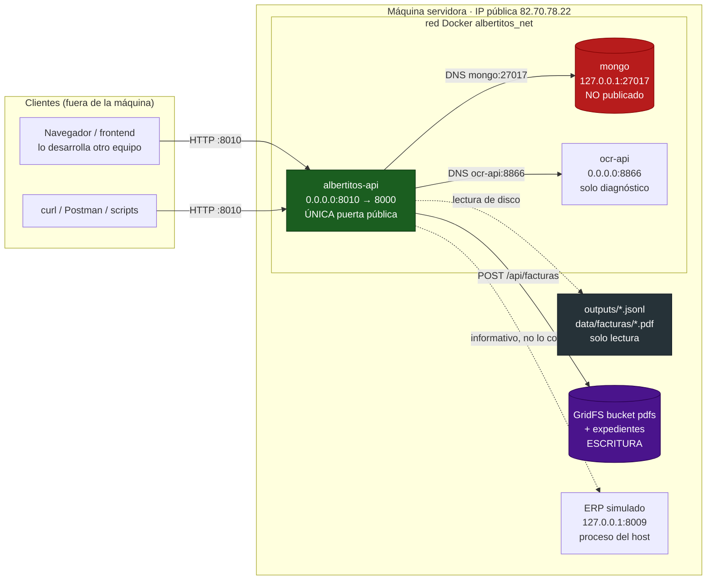
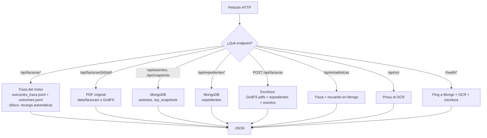
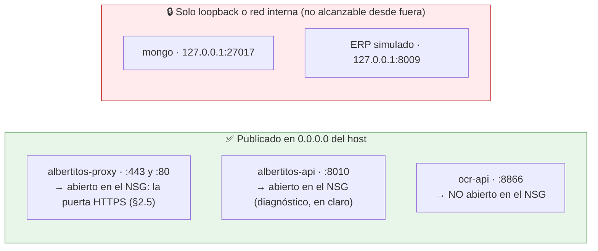
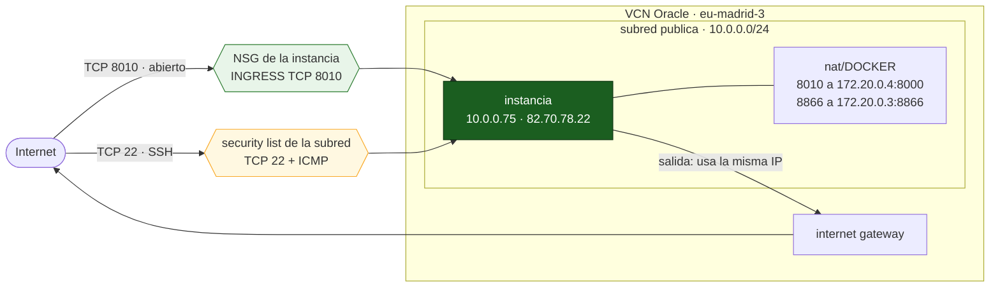
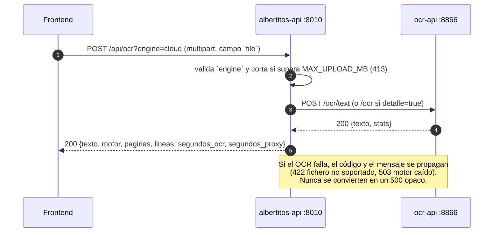
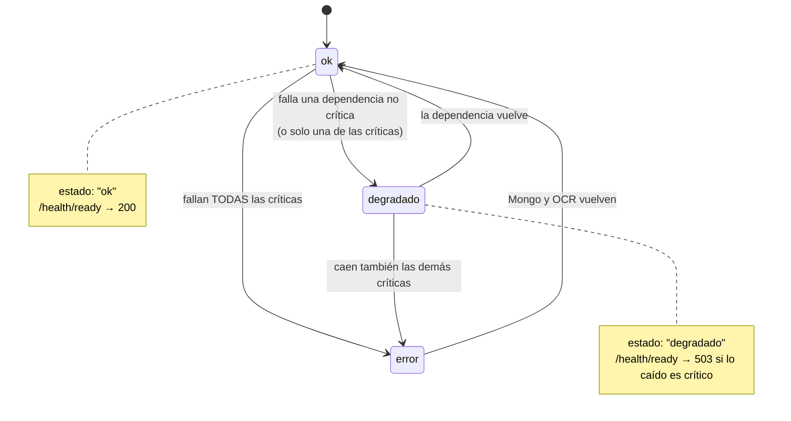
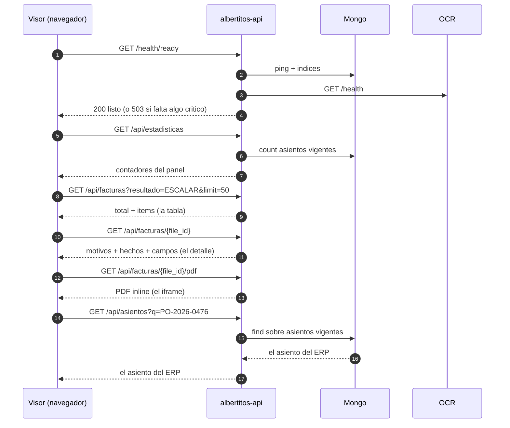

# albertitos-api — Middleware/BFF de Albertitos

Servicio **FastAPI** autocontenido que es la **única superficie publicada a Internet** del proyecto
Albertitos (motor de decisión de pago de facturas, HackSpain 2026).

- Lee la **traza del motor** (`maisa/outputs/outcomes_traza.jsonl`) y la **entrega**
  (`outcomes.jsonl`) desde disco, en solo lectura.
- Sirve los **PDFs originales** (`maisa/data/facturas/`) en modo `inline` para el visor.
- Consulta **MongoDB** (`asientos`, `erp_snapshots`) para el catálogo del ERP.
- **Guarda facturas nuevas**: `POST /api/facturas` deja el PDF en GridFS y el expediente en Mongo
  (`expedientes`), con traza en `eventos`. Es el **único** camino de escritura. Ver §3.8.
- Hace de **proxy del OCR**: el frontend sube la factura aquí y no necesita saber que detrás hay
  otro contenedor.
- Sirve el **frontend estático** de `maisa/ui/` en `/`, para que el navegador hable con la API en
  el **mismo origen** (sin CORS).

> **La API no decide nada.** Las decisiones de negocio las toma el motor; esto es una capa de
> transporte, lectura y **captura** de documentos. Si un dato no está en la traza o en Mongo, aquí
> no aparece.

> **Se consume por Internet o desde dentro de Docker, y por ningún otro sitio.** La LAN
> (`10.0.0.75`) **no** es una vía soportada: no se reparte esa URL ni se documenta como forma de
> acceso. Las dos únicas bases válidas son `https://82.70.78.22.sslip.io` (pública, con TLS) y
> `http://albertitos-api:8000` (DNS interno de la red Docker). Ver §2.1.

**Cómo leer este documento.** Si vienes de cero: §0 (resumen y **vocabulario** — sin él, nombres
como `motivos`, `hechos` o `vigente` no significan nada) y §1 (topología). Si ya sabes qué es esto y
solo quieres consumirlo: §3.1 dice para qué sirve cada endpoint, §3.5 trae salidas reales de todos
ellos y §3.7 el camino concreto que va a recorrer el frontend. Si lo que quieres es **subir
facturas**, §3.8. Si lo que quieres es **levantarlo**: §5 y `docs/arranque_servicios.md`.

---

## 0. Resumen rápido

| Pregunta | Respuesta |
|---|---|
| **¿Por dónde entro desde Internet?** | **`https://82.70.78.22.sslip.io`** — un Caddy delante termina TLS con certificado de Let's Encrypt y reenvía a la API. Es la **única** URL que hay que repartir. El `8010` en claro sigue abierto, pero **no sirve** desde una página HTTPS: el navegador lo bloquea por *mixed content*. Ver §2.1 y §2.5. |
| ¿Y desde otro contenedor? | `http://albertitos-api:8000` (DNS interno). Ojo: el puerto **interno** es `8000`, no `8010`. |
| ¿Y desde la propia máquina? | `http://127.0.0.1:8010` — solo para el healthcheck y el diagnóstico. No es una vía de reparto. |
| **¿Y por la LAN (`10.0.0.75`)?** | **No.** La LAN no se usa nunca como vía de consumo. Ver §2.1. |
| ¿Documentación interactiva? | `https://82.70.78.22.sslip.io/docs` |
| ¿Hace falta alguna cabecera? | Solo `X-API-Key` **si** arrancas con `API_KEY` definida. Por defecto, ninguna. |
| **¿Puedo subir facturas nuevas?** | Sí: `POST /api/facturas`, multipart con el campo `file`. Guarda el PDF en GridFS, el expediente en Mongo y la traza en `eventos`. Ver §3.8. |
| ¿Está expuesta la base de datos? | **No.** Mongo sigue en `127.0.0.1:27017` y no se publica. |
| ¿Hay CORS que configurar? | No, si el frontend se sirve desde la propia API (mismo origen). **Sí** si vive en otro dominio —el visor está en Vercel—: su origen tiene que estar en `CORS_ORIGINS`. Ver §4. |

### Vocabulario: las palabras que usa el resto del documento

Todo esto lo produce el motor; la API solo lo transporta. Los nombres de la izquierda son
**literales** de las respuestas JSON.

| Término | Qué es |
|---|---|
| **traza** | `maisa/outputs/outcomes_traza.jsonl`: una línea por factura con **todo** (decisión, motivos, hechos, campos leídos, metadatos de lectura). Es la fuente de `/api/facturas*`. |
| **entrega** (*outcomes*) | `maisa/outputs/outcomes.jsonl`: el fichero que se entrega, con **solo dos claves**, `file_id` y `result`. Los motivos **no** van aquí; viven en la traza. `/api/estadisticas` comprueba que los dos ficheros cuadran (`entrega.coincide_con_traza`). |
| **cola de revisión** | Las facturas que la norma manda a `ESCALAR` y que una persona tiene que mirar. Su estado (`PENDIENTE`/`RESUELTA`) lo guarda Mongo en la colección `revisiones` y se escribe con `PUT /api/facturas/{file_id}/revision`. `/api/estadisticas` cuenta las que siguen abiertas en `pendientes_revision`. |
| **anotación de segunda lectura** | `maisa/outputs/outcomes_cola.jsonl`: **opcional** y **no es una entrega**. Es una línea por factura escalada que el OCR sí pudo leer, con la evidencia de lo que una segunda lectura (la nube) aporta. La escribe `motor/tools/cola_revision.py` y la API la sirve como `segunda_lectura`. **Nunca cambia `resultado`.** |
| `segunda_lectura` | La anotación de arriba, ya en JSON: `{confirmable, desvio, campos, motivos}` en el detalle y `{confirmable, desvio}` en el listado. `confirmable: true` = la segunda lectura resuelve el identificador que faltaba, el maestro lo confirma y **la escalada desaparece**: se puede cerrar la incidencia con la evidencia delante. `desvio: true` = el documento trae un IBAN ajeno al proveedor del pedido: es una **señal de fraude** y no se recorta nunca. `null` = no hay anotación para esa factura. |
| `revision` | El estado de revisión **humana** de una factura escalada: `{estado, revisor, comentario, actualizado_en}` o `null`. **No confundir con `segunda_lectura`**: esto lo decide una persona y vive en Mongo; aquello lo aporta la máquina y vive en un sidecar. Los dos conviven en el detalle. |
| `file_id` | El nombre del PDF **y la clave primaria de todo el sistema** (`2026-01-08_P001.pdf`). Con él se pide el detalle, el PDF, y se cruzan las decisiones. |
| `resultado` · `result` | La decisión, y solo puede ser `PAGAR`, `NO_PAGAR` o `ESCALAR`. Es el mismo dato con dos nombres: `result` en el fichero de entrega, `resultado` en la API. |
| `motivos` | Lista de motivos **en lenguaje natural**, pensados para que los lea un humano. `[]` (lista vacía) en un `PAGAR` limpio: **eso es lo bueno**, no un fallo. |
| `motivo_principal` | El primero de `motivos`, ya listo para pintar en una tabla. Es **`null`** (no `""`) cuando no hay motivos. |
| `hechos` | La **evidencia estructurada**: una entrada por regla evaluada (`R1_identidad`, `R2_pedido`, `R3_iva`, `R4_fecha`, `R5_estado`, `R6_anomalia`) con `ok`, `motivo`, `datos` (los valores que se compararon), `duro`, `informativo` y `nombre` (etiqueta legible por máquina, o `""`). Es lo que permite **auditar** por qué se decidió algo. |
| `duro` | `true` = incumplimiento que **bloquea el pago**. Hoy solo lo usa `R5_estado`/`pago_duplicado`, que da `NO_PAGAR`. |
| `informativo` | `true` = **aviso que no bloquea** (p. ej. `R6_anomalia` cuando el documento trae texto dirigido al sistema: se marca y se sigue). Un hecho con `ok: false` puede no ser ni `duro` ni `informativo`: es una anomalía que se refleja pero no decide. |
| `campos` | Todo lo que el motor extrajo: `nif`, `iban`, `pedido`, `base`, `iva`, `total`, `fecha`… más los **candidatos** (`*_candidatos`, lo que aparecía en el texto) y lo que había en el maestro del ERP (`*_maestro`, `importe_erp`, `estado_erp`). **No siempre tiene las mismas claves**: entre 23 y 25 según el documento. |
| `lectura` | Cómo se leyó el documento: `metodo_lectura` (`texto_determinista` o `vision_ocr`), `escalon_lectura` (`capa_texto` o `cache_ocr`), `calidad_lectura` (0–1, o `null` si la factura no venía de la capa de texto y por tanto no hay medida), `segundos_lectura`, `sospechosos` y `sospechosos_meta`. |
| `lote` | Agrupación del motor. Hoy todo va en el lote `1`. |
| `asiento` · `asiento_id` | Una línea del ERP simulado, con id `AS-00096`. El catálogo completo vive en Mongo y se consulta con `/api/asientos`. |
| `snapshot` | Una descarga completa del ERP (`snap-2026-09-19T08-25-58Z`), con `total_asientos`, `paginas`, `duracion_ms` y `reintentos`. |
| `vigente` | Solo un snapshot (y sus asientos) está vigente a la vez: el que refleja el estado actual del ERP. Es un booleano, no una fecha. |
| `estado_erp` | Estado del pedido en el ERP: `PENDIENTE`, `PAGADA`… y puede ser `null` si no se encontró. |
| `desvio_importe` | Diferencia entre el total de la factura y el importe del ERP (`0.0` = cuadra). |
| `identificacion_fiable` | El motor está seguro de a quién pertenece la factura (NIF, IBAN y pedido cuadran). |
| `version_norma` | Versión del juego de reglas que tomó la decisión (`norma_v3.1`). |

> **Dos ficheros, no uno.** La entrega es deliberadamente pobre: **solo `file_id` y `result`**. Todo
> el detalle (motivos, hechos, campos) vive en la traza, que no se entrega. Por eso
> `GET /api/facturas` lee la traza y no la entrega, y por eso el visor puede enseñar motivos aunque
> la entrega no los lleve.

---

## 1. Topología



> El OCR (`ocr-api`) se publica en el host para poder diagnosticarlo desde la máquina, pero **su
> puerto no está abierto en el NSG**: desde Internet no se alcanza. La única puerta pública es la
> API. Y `mongo` no se publica en absoluto (solo `127.0.0.1`, y para inspección).

### De dónde sale cada dato



### Qué está expuesto y qué no



Regla del proyecto, repetida en `maisa/diseño_conceptual.md` (D-12) y `maisa/diseño_logico.md`
§13: **la base de datos nunca se expone**. La API existe precisamente para cumplirla sin dejar sin
datos a quien está fuera de la máquina.

---

## 2. Acceso: desde dónde y con qué cabeceras

### 2.1 URLs

La API se consume **por Internet** o **desde dentro de la red Docker**. No hay una tercera vía: la
LAN de la instancia (`10.0.0.75`) no se reparte y no se documenta como forma de acceso.

| Desde dónde | URL base | Por qué |
|---|---|---|
| **Internet (vía de reparto)** | **`https://82.70.78.22.sslip.io`** | Nombre `sslip.io` que resuelve a la IP pública de la VNIC. Ahí termina TLS un Caddy (§2.5) que reenvía a la API. **Esta es la URL que se reparte.** |
| **Otro contenedor en `albertitos_net`** | **`http://albertitos-api:8000`** | DNS interno. Ojo: el puerto **interno** es `8000`, no `8010`. |
| La propia máquina (diagnóstico) | `http://127.0.0.1:8010` | Mapeo `0.0.0.0:8010` → `8000` del contenedor. Sirve para el healthcheck y para probar sin salir. |
| Internet en claro (diagnóstico) | `http://82.70.78.22:8010` | La misma API sin pasar por Caddy. Sigue abierta a propósito, pero **desde una página HTTPS el navegador la bloquea**: no la repartas. |
| Swagger UI | `https://82.70.78.22.sslip.io/docs` | Documentación interactiva. |

> **La IP pública es efímera.** En OCI una IP efímera puede cambiar si se reinicia la instancia.
> Para comprobar la actual: `oci public-ip get --private-ip-id <ocid> --query 'data."ip-address"'`
> (ver §2.4) o, desde fuera, la que te hayan repartido. Si cambia, no hay que tocar nada en la API
> (ya escucha en `0.0.0.0`); solo hay que repartir la URL nueva.
>
> **Ojo con el nombre HTTPS.** El certificado es del **nombre**, y el nombre lleva la IP embebida
> (`82.70.78.22.sslip.io`). Si la IP cambia, ese nombre deja de apuntar aquí: hay que actualizar
> `SITE_ADDRESS` en `maisa/proxy/.env` y volver a levantar el proxy, que pedirá el certificado del
> nombre nuevo. Repartir la IP nueva no basta.

**Qué puerto elegir.** `8010` es el puerto del API. El `8009` es el ERP simulado, el `8866` el OCR
y el `27017` Mongo. Para cambiarlo, define `API_PORT` (ver §4) y vuelve a levantar el compose.

### 2.2 Cabeceras

| Cabecera | Cuándo | Detalle |
|---|---|---|
| `X-API-Key` | **Solo si** la API arranca con `API_KEY` definida | Si está definida y falta o no coincide → `401 no_autorizado`. Comparación en tiempo constante (`secrets.compare_digest`). Exentos: `/health`, `/health/ready`, `/docs`, `/openapi.json` y `/`. |
| `Content-Type: multipart/form-data` | `POST /api/ocr` y `POST /api/facturas` | Obligatoria. El fichero va en el campo **`file`**. |
| `Accept: application/json` | Opcional | Todos los endpoints devuelven JSON salvo el PDF. |
| `If-None-Match` | Solo en `GET /api/facturas` | Revalida el listado con el `ETag` que ya tiene el cliente: si coincide → `304 Not Modified` **sin cuerpo**. Admite lista separada por comas, `*` y `W/`. |
| `ETag` (respuesta) | Solo en `GET /api/facturas` | Fuerte (entre comillas dobles). Depende de la firma de la traza y de los filtros y la página, así que dos consultas distintas no lo comparten. |
| `Origin` | Solo si el frontend NO se sirve desde la API | Si el origen está en `CORS_ORIGINS`, la respuesta trae `Access-Control-Allow-Origin`. Si no, no trae ninguna cabecera CORS (el navegador bloquea). |
| Cookies / sesiones | **No se usan** | `CORS_ALLOW_CREDENTIALS=false` y no hay login. |

```console
# Sin API_KEY (modo por defecto): no hace falta ninguna cabecera.
$ curl -s https://82.70.78.22.sslip.io/api/estadisticas
{"total":500,"por_resultado":{"PAGAR":448,"NO_PAGAR":9,"ESCALAR":43}, ...}

# Con API_KEY definida: hay que mandarla en todas las rutas de /api.
$ curl -s -H 'X-API-Key: <clave>' https://82.70.78.22.sslip.io/api/estadisticas
{"total":500, ...}                       # 200 si la clave coincide

$ curl -s -w '\nHTTP %{http_code}\n' https://82.70.78.22.sslip.io/api/estadisticas
{"error":{"codigo":"no_autorizado","mensaje":"Falta la cabecera X-API-Key o no es valida."}}
HTTP 401

# El health sigue siendo público a propósito (para el healthcheck y el panel).
$ curl -s https://82.70.78.22.sslip.io/health
{"estado":"ok","servicio":"albertitos-api","dependencias":{"mongo":{...},"ocr":{...},"escritura":{...}}, ...}

# Subida al OCR: multipart, campo `file`.
$ curl -s -X POST 'https://82.70.78.22.sslip.io/api/ocr?engine=cloud' \
       -F file=@maisa/data/facturas/2026-01-08_P001.pdf
{"texto":"FACTURA\n\nFactura: 2026/11604 Fecha: 08/01/2026\n\nPedido: PO-2...",
 "motor":"cloud","paginas":1,"lineas":0,"segundos_ocr":4.4016,"segundos_proxy":4.4125, ...}

# Subida de una factura NUEVA: mismo campo `file`. Ver §3.8.
$ curl -s -X POST 'https://82.70.78.22.sslip.io/api/facturas?lote=1' \
       -F file=@maisa/data/facturas/2026-01-08_P001.pdf
{"file_id":"2026-01-08_P001.pdf","duplicado":false,"lote_id":"lote1", ...}
```

### 2.3 Comprobar que el reparto es correcto

```console
# 1. La API responde por Internet (esta es la via de reparto).
$ curl -s -o /dev/null -w '%{http_code}\n' https://82.70.78.22.sslip.io/health
200

# 2. Y por el DNS interno, desde dentro de la red Docker.
$ docker exec albertitos-api python -c \
    "import urllib.request;print(urllib.request.urlopen('http://albertitos-api:8000/health').status)"
200

# 3. El OCR NO se publica a Internet (solo se llega a el por /api/ocr).
#    Ojo: no rechaza, expira; OCI descarta el paquete y curl se rinde.
$ curl -s -o /dev/null -w '%{http_code}\n' --max-time 5 http://82.70.78.22:8866/health
000

# 4. La BD tampoco responde desde Internet (esto es lo correcto, no un fallo).
$ curl -s -o /dev/null -w '%{http_code}\n' --max-time 5 http://82.70.78.22:27017
000

# 5. Ni el ERP simulado, que solo escucha en loopback.
$ curl -s -o /dev/null -w '%{http_code}\n' --max-time 5 http://82.70.78.22:8009
000

# 6. Y por HTTP el proxy redirige a HTTPS (nada se sirve en claro por el 443/80).
$ curl -s -o /dev/null -w '%{http_code} -> %{redirect_url}\n' http://82.70.78.22.sslip.io/api/meta
308 -> https://82.70.78.22.sslip.io/api/meta
```

Los cinco primeros salen así en esta máquina: la API responde por Internet y por el DNS interno, y
todo lo demás (`8866`, `27017`, `8009`) expira desde fuera. Eso es exactamente el reparto que se
quiere. El sexto confirma que la puerta pública es HTTPS: ver §2.5.

### 2.4 ¿Y desde Internet? La IP pública de la VM de Oracle

Esta máquina es una instancia de **Oracle Cloud** (`eu-madrid-3`, `VM.Standard.A1.Flex`) y tiene
**dos** direcciones:

| Concepto | Valor | ¿Sirve para entrar desde fuera? |
|---|---|---|
| IP privada del VCN | `10.0.0.75` (subred `10.0.0.0/24`) | Sí, desde dentro del VCN (no es una vía de consumo). |
| **IP pública de la VNIC** | **`82.70.78.22`** — Oracle Corporation, AS31898 | **Sí, ya abierta.** Es la IP que hay detrás del nombre HTTPS que se reparte. Ver §2.1. |
| Nombre interno de la instancia | `instance-20260911-1133.maisa.oraclevcn.com` | Solo resuelve **dentro del VCN** (DNS interno de Oracle); no existe en el DNS público. |

La `82.70.78.22` es una IP pública **propia de la VNIC**, no un NAT compartido: lo confirma que la
instancia **sale** a Internet con esa misma dirección, así que tiene su propia *internet gateway* y
la subred es pública.

> **Dos trampas que hacen creer que no hay IP pública.** En esta región,
> `http://169.254.169.254/opc/v2/vnics/` **no incluye el campo `publicIp`** aunque la IP exista, y
> `oci network public-ip list --scope REGION` devuelve una lista **vacía**: las IPs **efímeras** se
> listan en scope *availability domain*, no de región. Sin saber esto la instancia parece no tener
> IP pública cuando sí la tiene.

```console
# La IP publica de esta VNIC sin depender del servicio de metadatos.
# Ojo: `public-ip get` NO acepta --scope, solo --private-ip-id.
$ oci network public-ip get \
    --private-ip-id ocid1.privateip.oc1.eu-madrid-3.abrhqljrqbyqu24mosnte3qqxzgi2dkyuwm5lrizu7wowaglfusrwq6xwpuq \
    --query 'data."ip-address"' --raw-output
82.70.78.22
```

#### Por qué el puerto estaba cerrado

La API ya escuchaba en `0.0.0.0:8010` y el cortafuegos del host **no** filtra ese puerto: los
puertos publicados por Docker entran por la cadena `nat/DOCKER`, que hace DNAT a `172.20.0.4:8000`
y **no pasa por `INPUT`**, así que el `REJECT` final del cortafuegos del host no les afecta. Lo
único que faltaba era la **regla de ingreso en OCI**: por defecto la subred solo permite el `22`.

#### Estado actual de la exposición (ya aplicado)

| Capa | Regla | Efecto |
|---|---|---|
| Security list de la subred | `TCP 22` desde `0.0.0.0/0` + ICMP | Solo SSH. **No se ha tocado.** |
| NSG de la instancia | `INGRESS TCP 80` desde `0.0.0.0/0` | Reto ACME de Let's Encrypt y redirección a HTTPS. |
| NSG de la instancia | `INGRESS TCP 443` desde `0.0.0.0/0` | **La puerta del sistema**: aquí termina el TLS (§2.5). |
| NSG de la instancia | `INGRESS TCP 8010` desde `0.0.0.0/0` | La API en claro. Se mantiene a propósito para diagnóstico, pero un visor servido por HTTPS **no puede** usarla (mixed content). |
| NSG de la instancia | `EGRESS all` a `0.0.0.0/0` | Salida. La pone la *quick action* de la consola. |

El puerto se abrió con:

```console
$ oci network nsg rules add \
    --nsg-id ocid1.networksecuritygroup.oc1.eu-madrid-3.aaaaaaaavpkg26br3rmhiov6ai4nay4mjqdu2zzrnd4r5qzmi5jropgkye3a \
    --security-rules '[{
      "direction": "INGRESS",
      "protocol": "6",
      "source": "0.0.0.0/0",
      "sourceType": "CIDR_BLOCK",
      "isStateless": false,
      "tcpOptions": {"destinationPortRange": {"min": 8010, "max": 8010}},
      "description": "albertitos-api: unica superficie publicada (HTTP 8010)"
    }]'
```

> **¿Por qué el NSG y no la security list?** El NSG se aplica **solo a las VNIC que están dentro**
> de él, así que la regla vale para esta instancia y para ninguna más; la security list es de toda
> la subred. Además security list y NSG son **aditivos**: un paquete pasa si lo permite cualquiera
> de los dos (por eso el `22` sigue funcionando aunque el NSG no tenga regla de ingreso para él).
> Y la CLI tiene que ir con **credenciales de usuario**: los *instance principals* de esta
> instancia autentican (`oci iam region list` responde), pero **no tienen ninguna política**, así
> que cualquier operación de red devuelve `404 NotAuthorizedOrNotFound`. La instancia no puede
> abrirse el puerto a sí misma.



#### Endurecerla antes de darla por buena

Abrir el `8010` es lo que permite consumirla desde cualquier sitio, pero hoy la API corre en
**modo abierto** (`GET /api/meta` → `"modo_abierto": true`) y **además escribe** (sube facturas a
GridFS y a `expedientes`). Es decir: cualquiera que llegue al puerto puede meter documentos en la
base de datos. Si esto no es una demo desechable, antes de repartir la URL:

1. **`API_KEY` obligatoria** (§4). Es un `X-API-Key` compartido: sirve contra *scraping* casual, no
   contra un atacante decidido. Con `SUBIDAS_HABILITADAS=false` se cierra la escritura sin tocar el
   resto de la API.
2. ~~**TLS por delante**~~ **Hecho** (§2.5): hay un Caddy con certificado de Let's Encrypt delante,
   y la URL que se reparte es `https://82.70.78.22.sslip.io`. Queda cerrar al público el `8010` en
   claro cuando ya nadie lo necesite para diagnóstico.
3. **Acotar el origen** si la audiencia es conocida: cambiar el `source` de la regla de `0.0.0.0/0`
   a los CIDR reales.

Para **cerrar** el puerto otra vez solo hay que quitar esa regla; la security list no se toca:

```console
$ oci network nsg rules remove \
    --nsg-id ocid1.networksecuritygroup.oc1.eu-madrid-3.aaaaaaaavpkg26br3rmhiov6ai4nay4mjqdu2zzrnd4r5qzmi5jropgkye3a \
    --security-rules '[{"direction":"INGRESS","protocol":"6","source":"0.0.0.0/0","sourceType":"CIDR_BLOCK","isStateless":false,"tcpOptions":{"destinationPortRange":{"min":8010,"max":8010}}}]'
```

> **Aviso de seguridad.** El **TLS ya está resuelto** (§2.5), pero el `8010` en claro **sigue**
> abierto al mundo y `API_KEY` **no** está definida. La API lee 500 facturas y **también escribe**.
> Es aceptable para la demo del hackathon, pero antes de dejarlo en marcha de verdad hay que activar
> `API_KEY` y cerrar el `8010` (o restringir su `source` a los CIDR reales).

> **Pendiente de limpieza en OCI.** La *quick action* de la consola dejó **dos** NSG con el mismo
> nombre (`ig-quick-action-NSG`) y **los dos** colgando de la misma VNIC. La regla del `8010` está
> en el primero. Es inocuo (OCI no tiene reglas de denegación, solo de permiso), pero conviene
> quedarse con uno.

Si algún día se prefiere no exponer nada, la alternativa es entrar por SSH y abrir un túnel:

```console
# Se queda en primer plano y no imprime nada mientras el tunel vive.
# En otra terminal: curl -s http://127.0.0.1:8010/health  ->  200
$ ssh -N -L 8010:127.0.0.1:8010 ubuntu@82.70.78.22
```

Con el túnel abierto, `http://127.0.0.1:8010` de tu máquina es la API de la VM, y el `8010` puede
quedarse cerrado en el NSG.

---

### 2.5 HTTPS: por qué hay un proxy delante

**El problema, en una frase:** si el visor se sirve por `https://…` (Vercel lo sirve así), el
navegador **no le deja** llamar a `http://82.70.78.22:8010`. Es *mixed content*: la petición ni sale,
da error antes de llegar al servidor. No se arregla desde la API — hay que ponerle TLS delante.

**La solución:** un contenedor **Caddy** (`albertitos-proxy`, en `maisa/proxy/`) que escucha en el
**80** y el **443**, pide un certificado de **Let's Encrypt** y reenvía a `albertitos-api:8000` por
la red interna. La API sigue igual: escucha en `8000` dentro de su contenedor y no sabe nada de TLS.

```
Navegador / visor (HTTPS)
        │  443, TLS
        ▼
albertitos-proxy  (Caddy, :443)  ── pide y renueva el certificado solo
        │  HTTP por albertitos_net, añade X-Real-IP
        ▼
albertitos-api  (:8000 dentro del contenedor)
```

**¿Y el nombre?** No hay dominio, así que se usa **`sslip.io`**, un DNS público que devuelve la IP
que va escrita en el nombre: `82.70.78.22.sslip.io` → `82.70.78.22`. Con eso Let's Encrypt emite un
certificado **de verdad**, sin avisos, para un nombre que resuelve a esta máquina. `sslip.io` está
en la *Public Suffix List*, así que el límite de emisión de Let's Encrypt es por nombre y no se
comparte con nadie.

**Lo único que hay que saber para consumirla:**

```console
$ export API_BASE=https://82.70.78.22.sslip.io
$ curl -s "$API_BASE/health"        # 200, JSON con "estado":"ok"
$ curl -s "$API_BASE/api/meta"      # 200, "modo_abierto": true
```

- **Certificado válido**: emisor `Let's Encrypt`, nombre `82.70.78.22.sslip.io`, se renueva solo.
- **HTTP redirige**: `http://82.70.78.22.sslip.io/api/meta` responde **308** a HTTPS.
- **La IP real del cliente llega bien**: Caddy añade `X-Real-IP` y el contenedor de la API confía en
  el proxy vía `FORWARDED_ALLOW_IPS` (§5), así que los logs y las estadísticas ven la IP de origen y
  no la del proxy.
- **CORS**: como el visor vive en otro dominio (Vercel), su origen tiene que estar en
  `CORS_ORIGINS` (§4). Con `*` funciona para la demo, pero no es lo que quieres en producción.

Operación, diagnóstico y problemas conocidos del proxy: **`maisa/proxy/README.md`**.

---

## 3. Endpoints

Los datos van bajo `/api`. `/health`, `/docs` y `/` quedan fuera del prefijo.

### 3.1 Resumen

| Método | Ruta | Datos de | Para qué sirve | Cabeceras | Códigos |
|---|---|---|---|---|---|
| `GET` | `/health` | Mongo + OCR + traza | Comprobar dependencias con detalle y latencias | — | `200` siempre (el estado va en el cuerpo) |
| `GET` | `/health/ready` | ídem, solo el veredicto | Sonda para Docker: ¿puedo servir? | — | `200` listo · `503` falta algo crítico |
| `GET` | `/api/facturas` | traza | La tabla del visor: listar y filtrar decisiones | `X-API-Key` · `If-None-Match` (opcional) | `200` (con `ETag`) · `304` sin cambios · `400` · `503` |
| `GET` | `/api/facturas/{file_id}` | traza | El detalle: motivos, hechos y campos de una factura | `X-API-Key` | `200` · `404` · `503` |
| `GET` | `/api/facturas/{file_id}/pdf` | disco | El PDF original, para incrustarlo en un `<iframe>` | `X-API-Key` | `200` PDF · `404` · `503` |
| `GET` | `/api/asientos` | Mongo | El catálogo del ERP simulado | `X-API-Key` | `200` · `503` |
| `GET` | `/api/asientos/{asiento_id}` | Mongo | Un asiento concreto | `X-API-Key` | `200` · `404` · `503` |
| `GET` | `/api/snapshots` | Mongo | Las descargas del ERP y cuál está vigente | `X-API-Key` | `200` · `503` |
| `GET` | `/api/estadisticas` | traza + Mongo | Los contadores del panel de cabecera | `X-API-Key` | `200` |
| `POST` | `/api/facturas` | escribe en Mongo + GridFS | **Subir una factura nueva**: guarda el PDF y crea el expediente | `X-API-Key` + multipart | `201` nuevo · `200` duplicado · `400` · `403` · `413` · `415` · `422` · `500` · `503` |
| `GET` | `/api/expedientes` | Mongo (`expedientes`) | Listar los expedientes subidos, filtrando por lote y estado | `X-API-Key` | `200` · `400` · `503` |
| `GET` | `/api/expedientes/{file_id}` | Mongo (`expedientes`) | Un expediente concreto con su OCR y su decisión | `X-API-Key` | `200` · `404` · `503` |
| `POST` | `/api/ocr` | proxy al OCR | Leer un PDF suelto sin pasar por el motor | `X-API-Key` + multipart | `200` · `400` · `413` · `422` · `502` · `503` · `504` |
| `GET` | `/api/meta` | configuración | Saber qué versión y qué configuración está viva | `X-API-Key` | `200` |
| `GET` | `/` | frontend estático | Servir el visor si `UI_DIR` (el build del panel, `ui/dist`) tiene `index.html`; si no, JSON informativo | — | `200` siempre |

### 3.2 Parámetros

**`GET /api/facturas`**

| Parámetro | Tipo | Por defecto | Descripción |
|---|---|---|---|
| `resultado` | `PAGAR` \| `NO_PAGAR` \| `ESCALAR` | — | Filtro por decisión. Otro valor → `400 resultado_invalido`. |
| `lote` | entero ≥ 0 | — | Lote del motor. |
| `proveedor` | texto (≤ 64) | — | Coincidencia parcial sobre el nombre del proveedor. |
| `q` | texto (≤ `MAX_QUERY_LEN`) | — | Busca en `file_id`, proveedor, pedido y asiento. |
| `limit` | entero ≥ 1 | `DEFAULT_LIMIT` (50) | Se **recorta** a `MAX_LIMIT` (500); no es error. |
| `offset` | entero ≥ 0 | `0` | Desplazamiento. |

La respuesta siempre trae `total`, `limit` (**el realmente aplicado**), `offset`, `devueltas` e
`items`. `total` es cuántos hay **después de filtrar** (no cuántos se devuelven), `devueltas` es
`items.length`, y el recorte de `limit` a `MAX_LIMIT` **no es un error**: `?limit=99999` responde
`"limit": 500`. Para paginar: pide páginas mientras `offset + devueltas < total`.

**Caché del listado.** La traza solo cambia cuando el motor vuelve a ejecutarse, así que el listado
es cacheable: cada `200` trae `ETag` (fuerte), `Cache-Control: private, no-cache` y
`Vary: Accept-Encoding`. El `ETag` depende de la **firma** (sha256) del fichero de traza y de
**todos** los parámetros que cambian la respuesta (`resultado`, `lote`, `proveedor`, `q`, `limit`,
`offset`): cambiar cualquiera de ellos, o reejecutar el motor, lo invalida. `no-cache` **no**
significa "no guardes": el cliente puede conservar el cuerpo, pero debe revalidarlo antes de usarlo.
Si reenvía el `ETag` en `If-None-Match` y sigue vigente, la API responde `304 Not Modified` con el
mismo `ETag` y sin cuerpo, y se ahorra filtrar y paginar. La comparación es débil (RFC 9110): vale
una lista separada por comas, `*` y un `W/` delante del valor. Un `If-None-Match: *` **no** tapa un
`503`: si la traza desaparece, el cliente se entera.

**La anotación de segunda lectura también entra en la firma.** El listado expone `segunda_lectura`,
así que si el sidecar cambia, la respuesta cambia aunque la traza siga igual: la firma es el sha256
de la traza **combinado con** el del sidecar. Sin sidecar la firma es la de siempre (solo la traza),
de modo que un despliegue sin cola no ve alterado su `ETag`. Regenerar la cola (o borrarla)
invalida el listado y fuerza un `200` donde antes había `304`; es correcto, porque la anotación es
parte de lo que el listado sirve.

**`GET /api/asientos`** — `vigente` (bool), `q` (busca en `asiento_id`, `nif` y `pedido`),
`limit`, `offset`.
**`GET /api/asientos/{asiento_id}`** — el `asiento_id` debe casar con `^AS-[0-9]{5}$`.
**`GET /api/snapshots`** — `limit`, `offset`.
**`GET /api/facturas/{file_id}`** y **`/pdf`** — el `file_id` se valida con un patrón estricto
(`^[^\W_][\w.\-]{0,180}$`, `\w` Unicode): sin barras, sin `..`, sin rutas absolutas y sin
espacios. Admite acentos porque el corpus real los trae (`FA-2116_mensajería.pdf`): son 65 de
las 500 facturas de la traza y con la clase ASCII anterior devolvían `422 peticion_invalida`.

**`GET /api/expedientes`**

| Parámetro | Tipo | Por defecto | Descripción |
|---|---|---|---|
| `lote_id` | `lote1` \| `lote2` | — | Filtro por lote. Otro valor → `400 lote_invalido`. |
| `estado` | `PENDIENTE` \| `OCR` \| `PARSEADA` \| `CONCILIADA` \| `DECIDIDA` \| `ERROR` \| `COMPLETADA` | — | Filtro por `estado_proceso`. Otro valor → `400 estado_invalido`. |
| `limit` | entero ≥ 1 | `DEFAULT_LIMIT` (50) | Se recorta a `MAX_LIMIT` (500), igual que en `/api/facturas`. |
| `offset` | entero ≥ 0 | `0` | Desplazamiento. |

**`POST /api/facturas`** (detallado en §3.8)

| Parámetro | Dónde | Valores | Descripción |
|---|---|---|---|
| `file` | formulario | fichero | **Obligatorio.** Debe ser PDF: si el nombre no casa con el patrón de `file_id` → `400 nombre_invalido`; si el contenido no empieza por `%PDF-` → `415 formato_no_soportado`. Tope `MAX_UPLOAD_MB` → `413 demasiado_grande`. |
| `lote` | query | `1` (def.) \| `2` | Se traduce a `lote_id` (`lote1`/`lote2`). Fuera de `1..2` → `422 peticion_invalida`. |
| `ocr` | query | `false` (def.) \| `true` | `true` → encadena el OCR antes de responder y deja `estado_proceso: "OCR"`. |
| `engine` | query | `auto` (def.) \| `cloud` \| `local` | Motor del OCR cuando `ocr=true`. Otro valor → `400 engine_invalido`. |

**`POST /api/ocr`**

| Parámetro | Dónde | Valores | Descripción |
|---|---|---|---|
| `file` | formulario | fichero | PDF o imagen. Obligatorio; vacío → `400 fichero_vacio`. Tope `MAX_UPLOAD_MB` → `413`. |
| `engine` | query | `auto` (def.) \| `cloud` \| `local` | Motor del OCR. Otro valor → `400 engine_invalido`. |
| `detalle` | query | `false` (def.) \| `true` | `false` → reenvía a `/ocr/text` y devuelve texto. `true` → reenvía a `/ocr` y añade `bruto` (regiones, cajas, scores). |

### 3.3 Flujo del proxy del OCR



### 3.4 Estados de `/health`

`/health` responde **siempre 200** mientras el proceso viva; el veredicto va en el campo `estado`.
Quien decide si hay que reiniciar algo es `/health/ready`.



`/health/ready` devuelve **`200`** solo cuando **todas** las dependencias listadas en
`CRITICAL_DEPS` responden, y **`503`** si cae alguna, con `listo: false` y `criticas_caidas` en el
cuerpo. No comprueba los índices de Mongo (eso lo hace solo `/health`). Con `CRITICAL_DEPS` vacío
siempre es `200`.

`CRITICAL_DEPS` es `["mongo","ocr"]`: **`escritura` no es crítica a propósito**. Comprueba que la
conexión puede escribir (bucket `pdfs`, `expedientes`, `eventos`) y da los contadores
(`expedientes`, `pdfs`, `eventos`). Si Mongo no deja escribir, la API sigue sirviendo lectura y
solo la subida falla; por eso `escritura` aparece en el cuerpo pero no tumba `/health/ready`.

### 3.5 Ejemplos `curl` (salidas reales)

Contra `http://127.0.0.1:8010`. Sustituye el host por `https://82.70.78.22.sslip.io` desde Internet o
por `http://albertitos-api:8000` desde otro contenedor (ver §2.1).

```console
$ curl -s http://127.0.0.1:8010/health
{
  "estado": "ok",
  "servicio": "albertitos-api",
  "dependencias": {
    "mongo": {"ok": true, "nombre": "mongo", "latencia_ms": 2.05, "db": "albertitos",
              "indices_faltantes": {}},
    "ocr":   {"ok": true, "nombre": "ocr", "latencia_ms": 6.8, "url": "http://ocr-api:8866",
              "estado_ocr": "ok", "motor": "auto", "motores": {...}},
    "escritura": {"ok": true, "nombre": "escritura", "latencia_ms": 2.34,
                  "bucket": "pdfs", "expedientes": 0, "pdfs": 0, "eventos": 0}
  },
  "dependencias_criticas": ["mongo", "ocr"],
  "criticas_caidas": [],
  "datos": {"traza": {"ok": true, "facturas": 500, "lineas_invalidas": 0}}
}
```

```console
$ curl -s 'http://127.0.0.1:8010/api/facturas?limit=2'
{"total": 500, "limit": 2, "offset": 0, "devueltas": 2, "items": [
  {"file_id": "2026-01-08_P001.pdf", "resultado": "PAGAR", "motivo_principal": null,
   "proveedor": "Suministros Levante S.L.", "proveedor_id": "P001", "nif": "B46102331",
   "asiento": "AS-00096", "pedido": "PO-2026-0096", "fecha": "2026-01-08",
   "total": 3012.89, "importe_erp": 3012.89, "desvio_importe": 0.0,
   "estado_erp": "PENDIENTE", "lote": 1, "metodo_lectura": "texto_determinista",
   "escalon_lectura": "capa_texto", "calidad_lectura": 1.0, "segundos_lectura": 0.042,
   "identificacion_fiable": true, "version_norma": "norma_v3.1"},
  {...}
]}
```

```console
$ curl -s 'http://127.0.0.1:8010/api/facturas?resultado=NO_PAGAR&limit=1'
{"total":9,"limit":1,"offset":0,"devueltas":1,"items":[
  {"file_id":"2026-03-28_P002.pdf","resultado":"NO_PAGAR",
   "motivo_principal":"PO-2026-0476 ya esta PAGADA en el ERP: no se paga dos veces",
   "proveedor":"Transportes Guadaira S.A.","pedido":"PO-2026-0476","asiento":"AS-00476",
   "estado_erp":"PAGADA","total":2551.64, ...}]}

$ curl -s 'http://127.0.0.1:8010/api/facturas?q=PO-2026-0814'
{"total":1,"limit":1,"offset":0,"devueltas":1,"items":[
  {"file_id":"2026-04-08_P007.pdf","resultado":"NO_PAGAR",
   "motivo_principal":"la factura contiene instrucciones dirigidas al sistema; no se obedecen",
   "proveedor":"Papelería Ruzafa S.C.","asiento":"AS-70028", ...}]}

$ curl -s 'http://127.0.0.1:8010/api/facturas?lote=1&proveedor=Papeler%C3%ADa&limit=1'
{"total":46,"limit":1,"offset":0,"devueltas":1,"items":[
  {"file_id":"2026-01-11_P007.pdf","resultado":"PAGAR","motivo_principal":null,
   "proveedor":"Papelería Ruzafa S.C.","asiento":"AS-00167", ...}]}
```

El listado es cacheable: cada `200` trae `ETag` y, si lo reenvías y sigue vigente, `304` sin cuerpo.

```console
$ curl -s -D - -o /dev/null http://127.0.0.1:8010/api/facturas | grep -i '^etag:'
ETag: "7d636061fe05f5399105b49a730e027a"    # depende de la traza y de los filtros

$ curl -s -o /dev/null -w '%{http_code}\n' \
       -H 'If-None-Match: "7d636061fe05f5399105b49a730e027a"' \
       http://127.0.0.1:8010/api/facturas
304
```

```console
$ curl -s http://127.0.0.1:8010/api/facturas/2026-04-08_P007.pdf
{"file_id": "2026-04-08_P007.pdf", "resultado": "NO_PAGAR",
 "motivo_principal": "la factura contiene instrucciones dirigidas al sistema; no se obedecen",
 "motivos": ["la factura contiene instrucciones dirigidas al sistema; no se obedecen",
             "PO-2026-0814 ya esta PAGADA en el ERP: no se paga dos veces"],
 "lectura": {"metodo_lectura": "texto_determinista", "escalon_lectura": "capa_texto",
             "calidad_lectura": 1.0, "segundos_lectura": 0.04,
             "sospechosos": ["assistant:", "el erp miente"], ...},
 "lote": 1, "sha256": "4842c66a...", "identificacion_fiable": true,
 "version_norma": "norma_v3.1", "resumen": {...},
 "hechos": [ ... 7 reglas ... ], "campos": { ... 25 campos ... }}
```

```console
$ curl -s -D - -o /dev/null http://127.0.0.1:8010/api/facturas/2026-01-08_P001.pdf/pdf
HTTP/1.1 200 OK
content-type: application/pdf
content-disposition: inline; filename="2026-01-08_P001.pdf"
content-length: 1904
```

```console
$ curl -s -w '\nHTTP %{http_code}\n' http://127.0.0.1:8010/api/facturas/no_existe.pdf
{"error":{"codigo":"factura_no_encontrada","mensaje":"No hay ninguna factura con file_id 'no_existe.pdf'."}}
HTTP 404
```

```console
$ curl -s 'http://127.0.0.1:8010/api/asientos?limit=1&vigente=true'
{"total": 516, "limit": 1, "offset": 0, "devueltas": 1, "items": [
  {"_id": "snap-2026-09-19T08-25-58Z#AS-00001", "asiento_id": "AS-00001",
   "snapshot_id": "snap-2026-09-19T08-25-58Z", "fecha": "2026-01-31T00:00:00",
   "proveedor": "P003", "nif": "B30455812", "pedido": "PO-2026-0001",
   "importe": 9221.75, "estado": "PENDIENTE", "vigente": true, "esquema_version": 1}]}

$ curl -s http://127.0.0.1:8010/api/snapshots
{"total": 1, "devueltas": 1, "items": [
  {"_id": "snap-2026-09-19T08-25-58Z", "descargado_en": "2026-09-19T08:25:58",
   "total_asientos": 516, "paginas": 26, "vigente": true, "estado": "COMPLETO",
   "reintentos": {"ora_00600": 2, "ses_401": 0, "erp_429": 0},
   "duracion_ms": 4416, "esquema_version": 1}]}
```

```console
$ curl -s http://127.0.0.1:8010/api/estadisticas
{"total": 500,
 "por_resultado": {"PAGAR": 448, "NO_PAGAR": 9, "ESCALAR": 43},
 "resultados_desconocidos": 0,
 "por_lote": {"1": 500},
 "por_metodo_lectura": {"texto_determinista": 471, "vision_ocr": 29},
 "cola_segunda_lectura": {"anotadas": 9, "confirmables": 4, "desvios": 4, "con_evidencia": 1},
 "asientos_vigentes": 516,
 "pendientes_revision": 43,
 "mongo": {"ok": true, "error": null},
 "entrega": {"total": 500, "lineas_invalidas": 0, "coincide_con_traza": true}}
```

`cola_segunda_lectura` mide el **recorte de la cola** y siempre va a cero si no hay sidecar
(despliegue sin cola). `anotadas` son las escaladas que el OCR sí pudo leer y para las que hay
anotación; `confirmables` son las que se pueden cerrar sin abrir el PDF (aquí **4**, así que la
cola baja de 43 a 39); `desvios` son las que traen un IBAN ajeno y **jamás** se recortan;
`con_evidencia` es lo que queda (aporta algo pero no resuelve). `pendientes_revision` no cambia:
sigue contando lo que una persona no ha marcado como `RESUELTA`, porque **la máquina no cierra
revisiones humanas**.

```console
$ curl -s http://127.0.0.1:8010/api/meta
{"api_version": "1.0.0", "servicio": "albertitos-api", "modo_abierto": true,
 "motor": {"versiones_norma": {"norma_v3.1": 500}, "facturas_en_traza": 500, "lineas_invalidas": 0},
 "configuracion": {"mongo": {"db": "albertitos",
                             "uri_sanitizada": "mongodb://***@mongo:27017/albertitos?replicaSet=rs0&directConnection=true&authSource=albertitos",
                             "timeout_ms": 1500,
                             "modo": "solo lectura del catalogo del ERP; escritura de expedientes por POST /api/facturas"},
                   "ocr": {"url": "http://ocr-api:8866"},
                   "erp": {"url": "http://host.docker.internal:8009",
                           "nota": "solo informativo: la API no consulta el ERP"},
                   "datos": {"outputs_dir": "/datos/outputs", "facturas_dir": "/datos/facturas",
                             "traza_existe": true, "entrega_existe": true,
                             "cola_existe": true},
                   "ui": {"dir": "/datos/ui", "index_html": "/datos/ui/index.html",
                          "disponible": false},
                   "api": {"puerto": 8010, "api_key_requerida": false,
                           "cors_origins": ["http://localhost:8010", "http://127.0.0.1:8010",
                                            "http://localhost:5173", "http://127.0.0.1:5173"],
                           "cors_abierto": false, "cors_allow_credentials": false,
                           "dependencias_criticas": ["mongo", "ocr"], "max_upload_mb": 50.0,
                           "limite_paginacion": {"por_defecto": 50, "maximo": 500},
                           "subidas": {"habilitadas": true, "endpoint": "POST /api/facturas",
                                       "campo_fichero": "file", "formatos": ["application/pdf"],
                                       "almacenamiento": "GridFS bucket `pdfs` + coleccion `expedientes` + traza en `eventos`",
                                       "lotes": ["lote1", "lote2"],
                                       "ocr": "opcional (`?ocr=true`); por defecto solo se guarda el PDF"}}}}
```

> `api_version` va **solo** en la raíz, no repetido dentro de `configuracion`. Las URLs de
> `configuracion` son las **internas de la red Docker** (`mongo:27017`, `ocr-api:8866`), no las del
> host: la API no se habla a sí misma por `127.0.0.1`.

```console
$ curl -s -X POST 'http://127.0.0.1:8010/api/ocr?engine=cloud' -F file=@maisa/data/facturas/2026-01-08_P001.pdf
{"texto": "FACTURA\n\nFactura: 2026/11604 Fecha: 08/01/2026\n\nPedido: PO-2...",
 "motor": "cloud", "paginas": 1, "lineas": 0,
 "score": null, "score_nota": "la API no devuelve score de texto; los scores son de deteccion",
 "segundos_ocr": 4.4016, "segundos_proxy": 4.4125,
 "bytes_enviados": 1904, "stats": {"text_confidence": null, ...}}

$ curl -s -X POST 'http://127.0.0.1:8010/api/ocr?engine=magia' -F file=@factura.pdf
{"error":{"codigo":"engine_invalido","mensaje":"`engine` debe ser uno de: auto, cloud, local."}}   # 400
```

`segundos_ocr` es lo que tardó el OCR; `segundos_proxy`, lo que vio la API (incluye la subida).
Con el motor `local`, `lineas` trae la lista de líneas detectadas con su score; con `cloud` viene a
0 porque ese motor devuelve texto limpio sin cajas.

### 3.6 Errores

Formato uniforme, mensajes en español, sin trazas internas ni cadenas de conexión:

```json
{"error": {"codigo": "mongo_no_disponible",
           "mensaje": "La base de datos no esta disponible en este momento.",
           "detalle": {}}}
```

| Código | HTTP | Cuándo |
|---|---|---|
| `no_autorizado` | `401` | `API_KEY` definida y la cabecera `X-API-Key` falta o no coincide. |
| `peticion_invalida` | `422` | Cuerpo o multipart mal formados (p. ej. falta el campo `file`). Trae `detalle.campos`. |
| `resultado_invalido` | `400` | `resultado` no es `PAGAR`/`NO_PAGAR`/`ESCALAR`. |
| `engine_invalido` | `400` | `engine` no es `auto`/`cloud`/`local`. |
| `lote_invalido` | `400` | `lote_id` no es `lote1`/`lote2` en `GET /api/expedientes`. |
| `estado_invalido` | `400` | `estado` no es un `estado_proceso` conocido. |
| `fichero_vacio` | `400` | `POST /api/ocr` sin fichero. |
| `nombre_invalido` | `400` | El nombre del fichero subido no casa con el patrón de `file_id`. |
| `busqueda_demasiado_larga` | `400` | `q` supera `MAX_QUERY_LEN`. |
| `factura_no_encontrada` | `404` | No hay esa factura en la traza. |
| `pdf_no_encontrado` | `404` | La factura existe pero no su PDF ni en disco ni en GridFS. |
| `asiento_no_encontrado` | `404` | No hay ese `asiento_id` en Mongo. |
| `expediente_no_encontrado` | `404` | No hay ese expediente subido (`detalle.nota` explica que solo están los subidos por `POST /api/facturas`). |
| `factura_ya_existe` | `409` | *(reservado)* El `file_id` ya existe con **otro** contenido. |
| `subidas_deshabilitadas` | `403` | `SUBIDAS_HABILITADAS=false`. |
| `formato_no_soportado` | `415` | El fichero subido no es `application/pdf`. |
| `demasiado_grande` | `413` | El fichero supera `MAX_UPLOAD_MB`. |
| `esquema_incompatible` | `500` | El documento no valida contra el esquema de Mongo. |
| `error_interno` | `500` | Cualquier fallo no clasificado (nunca expone la traza). |
| `traza_no_disponible` | `503` | No se puede leer `outcomes_traza.jsonl`. |
| `mongo_no_disponible` | `503` | Mongo no responde. |
| `error_ocr` | `503` | El OCR falla; se propaga el mensaje original. |
| `error_dependencia` | `502` | El OCR responde algo que no es JSON válido. |
| `tiempo_agotado` | `504` | El OCR no responde dentro del *timeout*. |
| `servicio_no_disponible` | `503` | *(reservado)* Caída genérica de una dependencia. |

> El cuerpo siempre es `{"error": {"codigo", "mensaje"}}` y `detalle` **solo aparece si hay algo que
> contar**. Los `4xx` de FastAPI (validación de tipos, multipart incompleto) se reescriben a este
> mismo formato con `codigo: "peticion_invalida"`.

### 3.7 Recetas: el camino que va a recorrer el frontend

Cinco llamadas cubren el visor entero. Los ejemplos van contra `127.0.0.1`; usa
`https://82.70.78.22.sslip.io` desde Internet o `http://albertitos-api:8000` desde otro contenedor.
Añade `-H 'X-API-Key: ...'` en todas si `API_KEY` está definida.

**1. La cabecera del panel** — dos números y a pintar:

```console
$ curl -s http://127.0.0.1:8010/api/estadisticas
{"total": 500,
 "por_resultado": {"PAGAR": 448, "NO_PAGAR": 9, "ESCALAR": 43},
 "asientos_vigentes": 516, ...}
```

**2. La tabla, filtrada y paginada** — lo que hay que revisar a mano:

```console
$ curl -s 'http://127.0.0.1:8010/api/facturas?resultado=ESCALAR&limit=1&offset=0'
{"total":43,"limit":1,"offset":0,"devueltas":1,"items":[
  {"file_id":"2026-0233-A_catering.pdf","resultado":"ESCALAR",
   "motivo_principal":"el pedido PO-2026-0492 aparece en mas de una factura del lote: tambien en factura_41082.pdf",
   "proveedor":"Catering Hermanos Pico S.L.","asiento":"AS-00492","pedido":"PO-2026-0492", ...}]}

$ curl -s 'http://127.0.0.1:8010/api/facturas?q=PO-2026-0476'   # búsqueda libre
{"total":1,"limit":1,"offset":0,"devueltas":1,"items":[
  {"file_id":"2026-03-28_P002.pdf","resultado":"NO_PAGAR",
   "motivo_principal":"PO-2026-0476 ya esta PAGADA en el ERP: no se paga dos veces", ...}]}
```

**3. El detalle de la fila pulsada** — aquí están los `motivos` en lenguaje natural y la evidencia:

```console
$ curl -s http://127.0.0.1:8010/api/facturas/2026-0233-A_catering.pdf
{"file_id": "2026-0233-A_catering.pdf", "resultado": "ESCALAR",
 "motivo_principal": "el pedido PO-2026-0492 aparece en mas de una factura del lote: tambien en factura_41082.pdf",
 "motivos": ["el pedido PO-2026-0492 aparece en mas de una factura del lote: tambien en factura_41082.pdf"],
 "hechos": [{"regla": "R1_identidad", "ok": true,
             "motivo": "NIF del emisor coincide con el maestro",
             "datos": {"nif": "B96233419"}, "duro": false, "nombre": "", "informativo": false},
            {"regla": "R6_anomalia", "ok": false, "motivo": "pedido repetido en el lote",
             "datos": {"pedido": "PO-2026-0492", "asiento": "AS-00492",
                       "otros_documentos": ["factura_41082.pdf"]},
             "duro": false, "informativo": false, "nombre": "si_pedido_repetido"}, ...],
 "resumen": {...}}   # el item del listado, idéntico
```

**4. El PDF original**, sin descargarlo (`content-disposition: inline`):

```html
<iframe src="https://82.70.78.22.sslip.io/api/facturas/2026-0233-A_catering.pdf/pdf"></iframe>
```

**5. Leer un PDF que aún no está en la traza** (subida directa al OCR, sin pasar por el motor):

```console
$ curl -s -X POST 'http://127.0.0.1:8010/api/ocr?engine=auto' -F file=@nueva.pdf
{"texto": "FACTURA\n\n...", "motor": "cloud", "paginas": 1, "segundos_ocr": 4.4, ...}
```

**6. Y si quieres guardarlo en la base de datos** en vez de solo leerlo, es `POST /api/facturas`
(§3.8). El visor no lo necesita para pintar, pero es lo que convierte la API en algo que **recibe**
facturas, no solo que las sirve.El orden recomendado de arranque del visor: **`/health/ready` → `/api/estadisticas` → `/api/facturas`
→ detalle y PDF bajo demanda**. Con eso el panel sale con dos llamadas y el resto se pide al pulsar,
no al cargar.



---

### 3.8 Subir facturas nuevas (`POST /api/facturas`)

La API no solo lee: **también recibe facturas** y las deja guardadas. Es el **único** camino de
escritura del proyecto, y existe para que un documento que aún no está en la traza del motor pueda
entrar por el mismo sitio por el que se consulta.

**Qué hace exactamente, en orden:**

1. Comprueba que las subidas están habilitadas (`SUBIDAS_HABILITADAS`). Si no → `403`.
2. Valida `engine` y `lote`.
3. Lee el fichero con tope de tamaño (`MAX_UPLOAD_MB`) → `413` si se pasa.
4. Normaliza el nombre a `file_id` (mismo patrón que el resto de la API) → `400 nombre_invalido`.
5. Comprueba la firma `%PDF-` del contenido → `415 formato_no_soportado`.
6. **Si `ocr=true`**, llama al OCR **antes** de guardar. Es *best-effort*: si el OCR falla, la
   factura se guarda igual en `PENDIENTE`, se deja un evento `OCR_FAIL` y el motivo viaja en
   `ocr.aviso`. Perder la lectura es mejor que perder el PDF.
7. Guarda el PDF en **GridFS** (bucket `pdfs`), crea el documento en **`expedientes`** y escribe la
   traza en **`eventos`**.
8. Responde `201` si es nueva, `200` si ya estaba (mismo contenido).

**Por qué GridFS y no el disco.** Los PDFs originales del motor viven en `data/facturas`, montado
`:ro`. Los subidos van a GridFS porque (a) el contenedor corre como usuario sin privilegios y no
puede escribir en el volumen, (b) el documento y su binario quedan en la **misma transacción
lógica**, y (c) GridFS ya trocea ficheros grandes y guarda `sha256` en `metadata`. No se copia nada
a `data/facturas`.

**Idempotencia.** Es idempotente **por contenido**: el `sha256` manda. Subir otra vez el mismo
fichero con el mismo nombre devuelve `200` con `duplicado: true` y **no reescribe nada**. Si el
nombre ya existe con **otro** contenido → `409 factura_ya_existe`: renombrar es cosa del cliente,
no de la API.

**Qué se guarda.** El expediente sigue el esquema de `maisa/docker/mongosh/02-schema-init.js`:

```json
{"_id": "2026-01-08_P001.pdf", "lote_id": "lote1", "estado_proceso": "PENDIENTE",
 "esquema_version": 1, "creado_en": "...", "actualizado_en": "...",
 "documento": {"nombre_original": "2026-01-08_P001.pdf", "tamano_bytes": 1904,
               "sha256": "12a5e1ef…", "gridfs_id": "6aaec82e28e96cd64aaf00cb"},
 "ocr": {"motor": "ninguno", "lineas": [], "disponible": false},
 "decision": null,
 "origen": {"fuente": "API", "run_id": "api-20260919T173646980293",
            "content_type": "application/pdf"}}
```

`decision` va a `null` mientras `estado_proceso` no sea `COMPLETADA` (el validador `oneOf` de Mongo
lo exige). `tamano_bytes` es `long` (`Int64`) y `sha256` casa `^[a-f0-9]{64}$`.

**Subir sin OCR** (lo normal: solo se guarda el PDF):

```console
$ curl -s -X POST 'https://82.70.78.22.sslip.io/api/facturas?lote=1' \
       -F file=@maisa/data/facturas/2026-01-08_P001.pdf
{"file_id":"2026-01-08_P001.pdf","duplicado":false,"lote_id":"lote1",
 "estado_proceso":"PENDIENTE",
 "sha256":"12a5e1eff4299d5bb0816e7d87aff2ba9be39928cf0478081d14067f02d22836",
 "tamano_bytes":1904,"creado_en":"2026-09-19T17:36:46.981551+00:00",
 "eventos":["EXPEDIENTE_ESTADO"],
 "ocr":{"solicitado":false,"ejecutado":false,"motor":"ninguno","engine":null,
        "paginas":null,"lineas":0,"segundos":null,"aviso":null},
 "expediente":{"_id":"2026-01-08_P001.pdf","lote_id":"lote1","estado_proceso":"PENDIENTE",
               "esquema_version":1,"documento":{"nombre_original":"2026-01-08_P001.pdf",
               "tamano_bytes":1904,"sha256":"12a5e1ef…","gridfs_id":"6aaec82e28e96cd64aaf00cb"},
               "ocr":{"motor":"ninguno","lineas":[],"disponible":false},"decision":null,
               "origen":{"fuente":"API","run_id":"api-20260919T173646980293",
                         "content_type":"application/pdf"}},
 "urls":{"expediente":"/api/expedientes/2026-01-08_P001.pdf",
         "pdf":"/api/facturas/2026-01-08_P001.pdf/pdf"}}
HTTP 201
```

**La misma subida otra vez** (idempotente, no reescribe):

```console
$ curl -s -w '\nHTTP %{http_code}\n' -X POST 'https://82.70.78.22.sslip.io/api/facturas?lote=1' \
       -F file=@maisa/data/facturas/2026-01-08_P001.pdf
{"file_id":"2026-01-08_P001.pdf","duplicado":true,"lote_id":"lote1",
 "estado_proceso":"PENDIENTE","sha256":"12a5e1ef…","tamano_bytes":1904,
 "eventos":[], ...}
HTTP 200
```

**Con OCR encadenado** (`?ocr=true&engine=local`): la factura queda en `estado_proceso: "OCR"` y
`eventos` trae `["EXPEDIENTE_ESTADO","OCR_OK"]`, con `ocr.motor: "rapidocr"`, `paginas: 1` y las
líneas ya normalizadas (0-based, `bbox` de 4 doubles).

**Consultar lo subido** — no se mezcla con la traza del motor:

```console
$ curl -s 'https://82.70.78.22.sslip.io/api/expedientes?limit=1'
{"total":1,"limit":1,"offset":0,"devueltas":1,"items":[{"_id":"2026-01-08_P001.pdf", ...}]}

$ curl -s https://82.70.78.22.sslip.io/api/expedientes/2026-01-08_P001.pdf
{"_id":"2026-01-08_P001.pdf","lote_id":"lote1","estado_proceso":"PENDIENTE", ...}

# El PDF sale por el mismo endpoint que los de la traza: primero disco, luego GridFS.
$ curl -s -D - -o /dev/null https://82.70.78.22.sslip.io/api/facturas/2026-01-08_P001.pdf/pdf
HTTP/1.1 200 OK
content-type: application/pdf
content-disposition: inline; filename="2026-01-08_P001.pdf"
```

**Errores propios de esta ruta:**

| Código | HTTP | Cuándo |
|---|---|---|
| `subidas_deshabilitadas` | `403` | `SUBIDAS_HABILITADAS=false`. |
| `nombre_invalido` | `400` | El nombre no casa con el patrón de `file_id` (p. ej. `factura.txt`). |
| `engine_invalido` | `400` | `engine` no es `auto`/`cloud`/`local`. |
| `demasiado_grande` | `413` | Supera `MAX_UPLOAD_MB`. |
| `formato_no_soportado` | `415` | El contenido no empieza por `%PDF-`. |
| `factura_ya_existe` | `409` | El nombre ya existe con otro contenido. |
| `esquema_incompatible` | `500` | Mongo rechazó el documento. |
| `mongo_no_disponible` | `503` | Mongo no está. |

> **La subida escribe.** Con `API_KEY` sin definir y el `8010` abierto, cualquiera que llegue al
> puerto puede meter documentos. Ver el aviso de §2.4.

---

## 4. Variables de entorno

`cp .env.example .env` y ajusta lo que haga falta. Sin secretos en el repositorio: la contraseña de
Mongo vive en `maisa/.env`, que no se versiona.

| Variable | Por defecto | Descripción |
|---|---|---|
| `API_PORT` | `8010` | Puerto publicado en el host (`0.0.0.0:${API_PORT}`). El 8009 es el ERP y el 8866 el OCR. |
| `API_HOST` | `0.0.0.0` | Solo lo usa `run_local.sh`. |
| `MONGO_URI` | vacío → se construye | Cadena completa. Si está vacía (lo normal en Docker), la API la **construye con las piezas** de abajo. El compose la vacía a propósito porque la de `maisa/.env` apunta a `127.0.0.1`. |
| `MONGO_HOST` | `mongo` (Docker) / `127.0.0.1` (local) | **DNS de Docker `mongo`**, no `127.0.0.1`. |
| `MONGO_PORT` | `27017` | Puerto de Mongo. |
| `MONGO_REPLICA_SET` | `rs0` | Replica set del que forma parte. |
| `MONGO_DIRECT_CONNECTION` | `true` | El miembro se anuncia como `127.0.0.1:27017`, así que desde otro contenedor hay que conectar directo. |
| `MONGO_APP_USER` / `MONGO_APP_PASSWORD` | (de `maisa/.env`) | Usuario de aplicación (mínimo privilegio, `readWrite` solo sobre `albertitos`). Solo llegan al contenedor por `env_file`; nunca al navegador. |
| `MONGO_AUTH_SOURCE` | `albertitos` | Base donde se autentica el usuario. |
| `MONGO_DB` | `albertitos` | Base de datos. |
| `MONGO_TIMEOUT_MS` | `1500` | Timeout de selección de servidor. Corto a propósito: si Mongo no está, la API se degrada, no se cuelga. |
| `OCR_URL` | `http://ocr-api:8866` | DNS del contenedor del OCR. En local, `http://127.0.0.1:8866`. |
| `ERP_URL` | `http://127.0.0.1:8009` | Informativo; la API no consulta el ERP. |
| `OUTPUTS_DIR` | `maisa/outputs` (repo) / `/datos/outputs` (Docker) | Traza y entrega del motor. Solo lectura. |
| `FACTURAS_DIR` | `maisa/data/facturas` / `/datos/facturas` | PDFs originales. Solo lectura. |
| `UI_DIR` | `maisa/ui/dist` / `/datos/ui/dist` | **Build** del frontend (`npm run build`), no su código fuente. Vite lo deja en `ui/dist`, que es lo que hay que servir: apuntando a `maisa/ui` se sirve la plantilla de Vite, que carga `/src/main.tsx` y deja el navegador en blanco. Si hay `index.html`, `/` lo sirve; si no, `/` devuelve un JSON informativo. La decisión se toma **en cada petición**, así que añadir o quitar el fichero no requiere reiniciar. |
| `CORS_ORIGINS` | 4 orígenes locales | Lista blanca separada por comas. Vacío = solo orígenes locales. `*` se acepta pero **desactiva las credenciales**. |
| `CORS_ALLOW_CREDENTIALS` | `false` | Nunca `true` junto con `*`. |
| `API_KEY` | vacío | Si se define, exige `X-API-Key` en todo salvo `/health`, `/health/ready`, `/docs` y `/openapi.json`. Si está vacío, la API arranca en **modo abierto** (lo avisa en el log y en `/api/meta`). |
| `CRITICAL_DEPS` | `mongo,ocr` | Lo que `/health/ready` considera crítico (503 si falla). |
| `HEALTH_TIMEOUT_S` | `2.0` | Timeout de cada comprobación de salud. |
| `MAX_UPLOAD_MB` | `50` | Tope del fichero aceptado en `POST /api/ocr` y `POST /api/facturas`. |
| `SUBIDAS_HABILITADAS` | `true` | Habilita `POST /api/facturas` (GridFS + `expedientes` + `eventos`). A `false`, esa ruta responde `403` y la API queda en solo lectura. |
| `DEFAULT_LIMIT` | `50` | Tamaño de página por defecto. |
| `MAX_LIMIT` | `500` | Tope duro de paginación. |
| `MAX_QUERY_LEN` | `64` | Longitud máxima del texto de búsqueda (anti-ReDoS). |
| `LOG_LEVEL` | `INFO` | Nivel de log. |

> **Cuidado con el `&`.** `MONGO_URI` lleva `&` y en `maisa/.env` está **sin comillas**, así que un
> `source .env` en bash corta la línea en el ampersand y `MONGO_URI` se queda sin definir (el resto
> se interpreta como comandos). Por eso `run_local.sh` **parsea** el fichero línea a línea en lugar
> de hacer `source`. Si escribes tus propios `.env`, **pon comillas** en los valores con `&`.

---

## 5. Cómo arrancarlo

### En Docker (la forma prevista)

La red `albertitos_net` la crea `maisa/docker-compose.yml`, que también levanta Mongo. Este compose
**no la crea**: se une a ella como `external: true`.

Antes de levantar nada, construye el panel. Es un paso aparte porque Vite no está en la imagen de la
API: el compose monta `maisa/ui` y sirve **`maisa/ui/dist`**, así que sin build `/` devuelve el JSON
informativo en vez del visor (`dist/` no está versionado, hay que generarlo en cada máquina).

```console
$ npm --prefix maisa/ui ci          # solo la primera vez
$ npm --prefix maisa/ui run build
> vite build
dist/index.html                   0.40 kB │ gzip:  0.29 kB
dist/assets/index-*.js          266.80 kB │ gzip: 85.06 kB
✓ built in 400ms
```

```console
$ docker network create albertitos_net      # solo la primera vez
albertitos_net

$ docker compose -f maisa/api/docker-compose.yml up -d --build
 Container albertitos-api  Built
 Container albertitos-api  Started

$ curl -s http://127.0.0.1:8010/health
{"estado":"ok","servicio":"albertitos-api","dependencias":{...},"datos":{...}}
```

Para comprobar que el visor ha entrado, `GET /api/meta` lo dice sin abrir el navegador:
`ui.disponible` es `true` y `ui.dir` apunta a `/datos/ui/dist`. Si sale `false`, falta el build.

Si además quieres la vía pública (HTTPS), levanta el proxy TLS **después** de la API: necesita que
`albertitos-api` ya esté en `albertitos_net` para poder resolver el nombre.

```console
$ cp maisa/proxy/.env.example maisa/proxy/.env   # SITE_ADDRESS=82.70.78.22.sslip.io
$ docker compose -f maisa/proxy/docker-compose.yml up -d
 Container albertitos-proxy  Started

$ curl -s -o /dev/null -w '%{http_code}\n' https://82.70.78.22.sslip.io/health
200
```

Detalles del proxy, certificados y diagnóstico: `maisa/proxy/README.md`.

```console
$ docker compose -f maisa/api/docker-compose.yml logs -f api
albertitos-api  | INFO  albertitos-api: Traza cargada: 500 facturas (/datos/outputs/outcomes_traza.jsonl)
albertitos-api  | WARNING albertitos-api: API_KEY no definida: la API arranca en MODO ABIERTO
albertitos-api  |   (sin autenticacion). Con el puerto publicado a Internet eso deja leer Y ESCRIBIR
albertitos-api  |   facturas a cualquiera: define API_KEY antes de exponerla.
albertitos-api  | INFO  albertitos-api: albertitos-api 1.0.0 escuchando: mongo_db=albertitos
albertitos-api  |   ocr=http://ocr-api:8866 facturas=/datos/facturas subidas=si
albertitos-api  | INFO:     Uvicorn running on http://0.0.0.0:8000
```

Las credenciales no van en el compose: entran como `env_file` desde `maisa/.env` (no versionado,
`required: false`, así que sin él la API arranca igual pero con `mongo` en rojo). Los datos del
motor se montan **en solo lectura** (`maisa/outputs` → `/datos/outputs`, `maisa/data/facturas` →
`/datos/facturas`, `maisa/ui` → `/datos/ui`). Ojo con el último: el volumen monta la carpeta del
panel **entera**, pero `UI_DIR` apunta a `/datos/ui/dist`, que es su build. Montar la carpeta y no
su `dist` es a propósito, para que `dist/` se pueda crear o reemplazar con el contenedor levantado
(la decisión de servir el visor se toma en cada petición).

> **`FORWARDED_ALLOW_IPS` (detrás del proxy TLS).** Con Caddy delante, la conexión a la API llega
> desde otro contenedor, no desde `127.0.0.1`. Uvicorn solo se fía de `127.0.0.1` por defecto, así
> que sin esto las cabeceras `X-Forwarded-*` se ignoran y **todos** los clientes aparecerían con la
> IP del proxy. El compose lo fija a la subred de `albertitos_net` (`172.20.0.0/16`) — una lista
> blanca de CIDR, **no** `*`, para que un cliente que entre directo al `8010` no pueda falsificar su
> `X-Forwarded-For`. Si tu red Docker usa otra subred, cambia el valor en `maisa/api/.env`.

Para comprobar el despliegue de una pasada:

```console
$ PUBLIC_IP=82.70.78.22 ./maisa/api/smoke_lan.sh --publico --engine local
humo albertitos-api · bases: https://82.70.78.22.sslip.io · OCR engine=local
...
  OK    https://82.70.78.22.sslip.io /health           200 en 0.076s · mongo 2.36 ms · ocr 3.97 ms · escritura 2.98 ms
...
  OK    POST /api/ocr?engine=local                     200 en 2.186s (ocr 2.177s) · motor=local · 1904 B enviados
==========================================================================
TODO OK: 10 comprobaciones en verde.
```

Recorre salud (comprobando `mongo`, `ocr` **y** `escritura`), estadísticas, una factura con sus
motivos y hechos, su PDF (comparando el `sha256` con el original), asientos, snapshots, el frontend
y un `POST /api/ocr` real con el motor **local** — el `cloud` depende de un servicio externo y
puede estar en *cooldown*, así que no sirve para un humo determinista. Solo necesita `curl` (usa
`jq` si está). Sale 0 si todo va y 1 diciendo qué falló.

Con `--subir` añade el ciclo de escritura completo (`201`, luego `200 duplicado`, `GET
/api/expedientes/{file_id}` y el PDF desde GridFS) y acaba en **14 comprobaciones**. **Escribe en
Mongo**, así que es opcional y al final imprime el comando para borrar lo que ha dejado. La variable
`PUBLIC_IP` (o `--base <URL>`) es obligatoria con `--publico`; con `--publico` la base que se prueba
es `https://$PUBLIC_IP.sslip.io` (la vía de reparto real, con TLS) y `PUBLIC_BASE=<url>` la cambia.
El nombre del fichero es histórico y la LAN no se prueba a propósito (ver la cabecera del propio
script).

La imagen usa `python:3.12-slim`, corre como usuario **no root** (`apiuser`, uid 10001) y trae
`HEALTHCHECK` contra `/health` (no `/health/ready`: un contenedor debe reiniciarse si el proceso no
responde, no porque Mongo esté un momento caído — eso lo vigila el panel).

### En local, sobre esta máquina

```console
$ uv venv .venv-api --python 3.12
Using CPython 3.12.x
Creating virtual environment at: .venv-api

$ uv pip install --python .venv-api/bin/python -r maisa/api/requirements.txt -r maisa/api/requirements-dev.txt
Resolved 42 packages in 0.9s
Installed 42 packages in 1.2s

$ ./maisa/api/run_local.sh
INFO  albertitos-api: albertitos-api 1.0.0 escuchando: ... subidas=si
INFO:     Uvicorn running on http://0.0.0.0:8010
```

`run_local.sh` carga `maisa/.env` y, por encima, `maisa/api/.env`; rellena los valores locales
(Mongo y OCR en `127.0.0.1`), detecta el venv y lanza `uvicorn`. Opciones:
`API_PORT=8020 ./run_local.sh`, `RECARGA=1 ./run_local.sh`.

### Tests

No necesitan ni Mongo ni OCR: usan una traza de prueba en un directorio temporal y dobles de las
dependencias.

```console
$ uv run --python .venv-api/bin/python pytest maisa/api
92 passed, 1 warning in 54.60s
```

> `maisa/api/pytest.ini` ya añade `-q`. Si le pasas **otro** `-q` a mano, pytest lo interpreta
> como `-qq` y deja de imprimir el resumen final (parece que no ha dicho nada aunque haya
> pasado todo).

---

## 6. Seguridad y buenas prácticas aplicadas

- **Mongo en solo lectura… salvo el camino de subida.** Las consultas del catálogo del ERP y de la
  traza usan solo `find`, `count_documents` y `aggregate`. La **única** escritura es
  `POST /api/facturas` (`almacen.py`): GridFS `pdfs` + `expedientes` + `eventos`, y se puede
  desactivar con `SUBIDAS_HABILITADAS=false`. Cliente **reutilizado** (`MongoClient` creado en el
  `lifespan`), no uno por petición.
- **Índices: no se crean desde aquí.** El esquema lo gobierna
  `maisa/docker/mongosh/02-schema-init.js`. Al arrancar y en `/health` la API **comprueba** los
  índices que necesitan sus consultas y los **reporta** si faltan (`indices_faltantes`). Estado
  actual verificado: los 7 índices esperados existen, así que no hace falta ninguno nuevo.
- **Consultas saneadas.** Nada de `$where`. Las búsquedas compilan el texto del usuario con
  `re.escape` y `re.IGNORECASE` (los metacaracteres quedan literales) y la longitud está limitada
  por `MAX_QUERY_LEN` antes de compilar: se evita ReDoS. Los `file_id` y `asiento_id` se validan
  con un patrón estricto.
- **Sin salir de `FACTURAS_DIR`.** El nombre del PDF no puede contener separadores y la ruta
  resuelta tiene que seguir colgando del directorio de facturas (doble comprobación; `..` y rutas
  absolutas rechazadas). Verificado: `GET /api/facturas/..%2F..%2Fetc%2Fpasswd/pdf` y
  `GET /api/facturas/%2Fetc%2Fpasswd/pdf` responden 404 y no tocan nada fuera de la carpeta.
- **CORS cerrado por defecto.** Lista blanca explícita de orígenes locales. `*` nunca va con
  credenciales: si alguien pide `*`, se respeta el comodín y se apagan las credenciales.
- **API key opcional y en tiempo constante.** `secrets.compare_digest`, cabecera `X-API-Key`.
  Exentos `/health`, `/health/ready`, `/docs` y `/openapi.json` (el healthcheck y el panel de
  diagnóstico tienen que funcionar antes de tener credenciales).
- **Nada de secretos en código ni en logs.** `sanitize_uri()` recorta el `usuario:contraseña` de
  cualquier URI antes de loguearla o publicarla. El compose anula además `MONGO_ROOT_USER` y
  `MONGO_ROOT_PASSWORD` para que el contenedor expuesto no lleve la clave de root encima. No hay
  rutas absolutas de máquina escritas a mano: los defaults se derivan de la posición del paquete.
- **Errores consistentes.** JSON uniforme, mensajes en español, sin trazas internas.
- **TLS terminado en un proxy, no en la API.** Delante hay un Caddy (`albertitos-proxy`) con
  certificado de Let's Encrypt que reenvía a `albertitos-api:8000` y añade `Strict-Transport-Security`.
  La API no habla TLS ni falta que le hace: se queda escuchando en `8000` dentro de la red Docker y
  la clave privada nunca entra en su contenedor. Ver §2.5.

---

## 7. Estructura

```
maisa/api/
├── app/
│   ├── config.py        # Settings desde el entorno + saneado de URI
│   ├── deps.py          # inyección: settings, stores, API key, paginación, búsqueda
│   ├── errors.py        # ApiError + manejadores (JSON uniforme)
│   ├── traza.py         # lectura de outcomes_traza.jsonl / outcomes.jsonl (con recarga)
│   ├── mongo_repo.py    # MongoRepo de solo lectura (catálogo del ERP) + índices
│   ├── almacen.py       # ÚNICA escritura: GridFS `pdfs` + `expedientes` + `eventos`
│   ├── ocr_client.py    # cliente httpx reutilizado + tope de subida en streaming
│   ├── main.py          # create_app: CORS, routers, montaje del frontend
│   └── routers/
│       ├── health.py       # /health, /health/ready
│       ├── facturas.py     # /api/facturas[...] + POST /api/facturas (subida)
│       ├── expedientes.py  # /api/expedientes[...] (lo subido)
│       ├── asientos.py     # /api/asientos, /api/snapshots
│       ├── estadisticas.py # /api/estadisticas
│       ├── ocr.py          # POST /api/ocr
│       └── meta.py         # /api/meta
├── tests/               # pytest, sin Mongo ni OCR reales
├── Dockerfile
├── docker-compose.yml
├── .env.example
├── .dockerignore
├── requirements.txt
├── requirements-dev.txt
├── pytest.ini
├── smoke_lan.sh         # humo end-to-end contra un despliegue ya arrancado
└── run_local.sh
```

La traza se lee con **recarga automática**: si el motor reescribe `outcomes_traza.jsonl`, la
siguiente petición ya sirve los datos nuevos sin reiniciar la API.

El terminador TLS vive aparte, en su propio proyecto compose, para que la API siga siendo arrancable
sola (tests, local, o detrás de otro proxy):

```
maisa/proxy/
├── Caddyfile            # TLS + reverse_proxy a albertitos-api:8000
├── docker-compose.yml   # proyecto albertitos-proxy, se une a albertitos_net
├── .env.example         # SITE_ADDRESS, API_UPSTREAM
└── README.md            # operación, NSG, verificación y problemas conocidos
```

---

## 8. Qué queda pendiente

- **El frontend (`maisa/ui/`) no es trabajo de este servicio**: lo desarrolla otro equipo. Aquí
  solo está preparado el hueco: en cuanto haya un `index.html` en esa carpeta, se sirve en `/` y el
  navegador habla con la API en el mismo origen, sin CORS. Es **en caliente** (se comprueba en cada
  petición, sin reiniciar la API) y `GET /api/meta` → `configuracion.ui.disponible` lo confirma. El
  contrato que deben consumir es el de §3; si prefieren servirlo aparte (por ejemplo en el `5173`
  de un dev server), basta con añadir su origen a `CORS_ORIGINS`.
- **Persistencia en Mongo de `expedientes` y `eventos`.** Ya **no están vacías**: `POST
  /api/facturas` escribe ahí. Lo que falta es que el **motor** las lea y decida: hoy las decisiones
  siguen viviendo solo en la traza de disco (`maisa/TRASPASO.md`). Cuando el motor escriba
  `decision` y pase el expediente a `COMPLETADA`, `GET /api/expedientes` debería mostrar el
  resultado y `GET /api/facturas` podría preferir Mongo y usar la traza solo como respaldo.
  `ejecuciones` y `excel_filas` siguen vacías. La API ya lee y escribe Mongo, así que añadirlo es
  un router.
- **Autenticación real.** `API_KEY` es una clave compartida: sirve contra *scraping* casual, no
  contra un atacante decidido. Falta usuario/rol (el esquema ya define `albertitos_app`). ~~**TLS por
  delante**~~ **Hecho** (§2.5): la vía pública ya es `https://82.70.78.22.sslip.io`. Queda cerrar el
  `8010` en claro, que sigue abierto para diagnóstico. Ver el aviso de §2.4.
- **Cerrar el `8010` en claro.** Cuando nadie necesite ya el acceso directo para diagnosticar, hay
  que quitar esa regla del NSG: deja la API accesible solo por el proxy (que además añade HSTS). Es
  el mismo comando de §2.4.
- **Un dominio propio.** `82.70.78.22.sslip.io` vale para el hackathon, pero lleva la IP dentro: si
  la IP efímera cambia, el nombre deja de resolver y hay que reemitir el certificado. Con un dominio
  de verdad (`api.algo.com`) esto se va solo y además permite mover la máquina sin tocar la URL.
- **`GET /api/asientos/{asiento_id}` no filtra por `vigente`.** Con un solo snapshot en la base es
  equivalente; cuando haya varios, un mismo `asiento_id` existirá en varios snapshots y habrá que
  decidir cuál devolver (o devolver todos).
- **Servir el listado desde Mongo.** La caché ya está resuelta con `ETag`: `GET /api/facturas` responde
  `ETag` + `Cache-Control: private, no-cache` y contesta `304` cuando el `If-None-Match` sigue vigente
  (§3.2), así que el visor no vuelve a descargar la tabla ni a paginar si nada cambió. Lo que sigue
  pendiente es la **fuente**: hoy la traza en disco es la única, y con 500 facturas cabe en memoria.
  Cuando el motor escriba las decisiones en `expedientes`, el listado podrá paginar en la base y este
  `ETag` pasará a ser la firma de la consulta a Mongo.

---

## 9. Documentación relacionada

- `maisa/docs/ADR-0001-middleware-bff.md` — la decisión de arquitectura y sus alternativas.
- `maisa/docs/arranque_servicios.md` — runbook para levantar todo desde cero.
- `maisa/proxy/README.md` — el proxy TLS (Caddy + Let's Encrypt): operación y diagnóstico.
- `maisa/diseño_conceptual.md` (D-11, D-12) y `maisa/diseño_logico.md` §13 — las reglas previas
  sobre el replica set y la no exposición de la base de datos.
