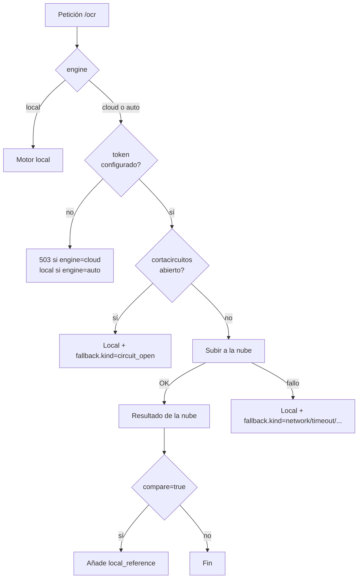

# OCR API — CPU ARM64 (RapidOCR + ONNX Runtime, modelos PP-OCRv5)

Servicio OCR con API REST que devuelve **texto + score de confianza** por línea

detectada, además de las coordenadas opcionales de cada recuadro.

Hay **dos motores** y el servicio elige solo:

| Motor | Dónde corre | Cuándo se usa |
|---|---|---|
| **Nube** (PaddleOCR-VL por API) | Baidu AI Studio | Por defecto, si hay token y la API responde |
| **Local** (PP-OCRv5 en ONNX) | Este contenedor | Si la nube falla, o si pides `engine=local` |

Ver [Motor en la nube](#motor-en-la-nube) para las diferencias de calidad medidas,
que no son las que uno esperaría.

> **Dónde vive esto.** Este servicio es `maisa/ocr_service/` del repositorio de
> entrega. Su corpus de prueba son los 500 PDFs del reto, que están en
> `maisa/data/facturas/`; aquí solo queda `test_files/test.png`. Los PDFs y los
> informes que se usaron para elegir motor y escala (`docs/`, `docs_review/`,
> `inspect_out/`) viven fuera del repositorio, en `_scratch/`, y no se publican.
> El `.env` real lleva el token de la nube y está en `.gitignore`; lo versionado
> es `.env.example`, con el token vacío.

> **¿Por qué RapidOCR y no PaddleOCR directo?**
> Son **los mismos pesos** de PaddleOCR (det/cls/rec exportados a ONNX), pero
> ONNX Runtime es **1.5–2.5× más rápido que Paddle Inference en CPU** según los
> benchmarks oficiales de Paddle, y la imagen Docker pesa ~700 MB en lugar de ~2 GB+.
> En ARM64 la diferencia es mayor: Paddle para aarch64 no incluye MKL-DNN.

---

## Endpoints

| Endpoint | Método | Descripción |
|---|---|---|
| `http://<IP>:8866/ocr` | POST | OCR completo: texto + score + cajas. `multipart/form-data`, campo `file` |
| `http://<IP>:8866/ocr/text` | POST | Igual pero sin coordenadas (respuesta más pequeña) |
| `http://<IP>:8866/ocr/stream` | POST | Igual que `/ocr` pero en **NDJSON**, una línea por página |
| `http://<IP>:8866/health` | GET | Estado del servicio, motores y límites |
| `http://<IP>:8866/cloud` | GET | Estado de la nube (sin exponer el token) |
| `http://<IP>:8866/docs` | GET | Swagger UI interactiva |

Parámetros de `POST /ocr` y `POST /ocr/stream`:

| Parámetro | Valores | Descripción |
|---|---|---|
| `engine` | `auto` \| `cloud` \| `local` | `auto` (defecto) prueba la nube y cae al local |
| `compare` | `true` \| `false` | Solo en `/ocr`: añade `local_reference` con la lectura local |
| `include_boxes` | `true` \| `false` | Coordenadas por línea |
| `scale`, `auto_scale` | número / booleano | Resolución de renderizado (solo afecta al motor local) |

Acepta **imágenes** (png/jpg/webp/…) y **PDFs multipágina**.

---

## Uso

```bash
# Levantar (el primer build descarga los modelos; ~5-10 min)
docker compose up -d --build

# Ver logs / progreso
docker compose logs -f

# Health check
curl -s http://localhost:8866/health | jq

# Probar con un archivo local
./test_ocr.sh ./test_files/test.png

# Humo completo: localhost + LAN + motores + un PDF cronometrado
./smoke_lan.sh ../data/facturas/2026-01-25_P001.pdf

# Forzar el motor local (sin tocar la red)
curl -s -X POST "http://localhost:8866/ocr?engine=local" -F "file=@docs/scan_001.pdf" | jq

# Documento grande: una línea JSON por página, según van saliendo
curl -sN -X POST "http://localhost:8866/ocr/stream" -F "file=@documento.pdf"
```

Desde otra máquina de la red:

```bash
curl -s -X POST -F "file=@documento.png" http://<IP-DE-LA-MAQUINA>:8866/ocr | jq
```

### Prueba de humo por LAN

`smoke_lan.sh` verifica de una pasada que el servicio responde por localhost **y** por
la IP de LAN, lista los motores disponibles y cronometra un documento real:

```bash
./smoke_lan.sh ../data/facturas/2026-01-25_P001.pdf        # autodetecta la IP de LAN
./smoke_lan.sh ../data/facturas/2026-01-25_P001.pdf 10.0.0.75
OCR_ENGINE=cloud ./smoke_lan.sh factura.pdf               # forzar un motor concreto
```

Sale con código 1 y un mensaje explícito si el OCR no responde, indicando si el fallo
está en localhost (servicio caído) o en la LAN (binding o firewall). Solo necesita
`curl`; `jq` es opcional.

**Verificado el 2026-09-19** (contenedor `ocr-api`, `0.0.0.0:8866->8866`): `/health`,
`/cloud` y `/docs` devuelven 200 tanto por `127.0.0.1` como por `10.0.0.75` (mismo JSON,
byte a byte), y `/ocr/text` reconoce facturas reales por la IP de LAN.

Dos avisos importantes si depuras desde otra máquina o desde otro contenedor:

- **Desde otro contenedor, usa el nombre DNS, no la IP de LAN.** Dentro de una red
  Docker, `http://ocr-api:8866/health` funciona (alias `ocr-api` y `ocr`), pero
  `http://<IP-DE-LAN>:8866/health` falla con `curl: (7) ... Host is unreachable`.
  No es un fallo del OCR: la regla `iptables -t nat` que publica el puerto excluye el
  tráfico que entra por la propia interfaz puente (`! -i br-...`), así que el paquete
  no se redirige al contenedor y acaba tratándose como entrega local, donde la cadena
  `INPUT` lo rechaza. Desde fuera de Docker (otra máquina) esa exclusión no aplica y el
  DNAT sí funciona.
- **El host tiene la cadena `INPUT` endurecida** (solo acepta `lo` y el puerto 22, y
  rechaza el resto con `icmp-host-prohibited`). No afecta al OCR porque el puerto
  publicado se atiende por DNAT/`FORWARD`, no por `INPUT`; pero sí afecta a cualquier
  servicio que escuche en el host sin publicarse por Docker.

---

## Formato de respuesta

```json
{
  "file": "factura.png",
  "pages": 1,
  "elapsed": 3.412,
  "stats": { "lines": 2, "mean_score": 0.965, "min_score": 0.943 },
  "text": "FACTURA\nTotal: $1.250",
  "lines": [
    { "text": "FACTURA",       "score": 0.987, "box": [[x1,y1],[x2,y2],[x3,y3],[x4,y4]] },
    { "text": "Total: $1.250", "score": 0.943, "box": [[x1,y1],[x2,y2],[x3,y3],[x4,y4]] }
  ],
  "results": [
    {
      "page": "page_1",
      "size": { "width": 2382, "height": 3368 },
      "elapsed": 2.288,
      "scale": 4.0,
      "alpha_ratio": 0.9349,
      "lines": [ "…mismo contenido que arriba…" ],
      "text": "FACTURA\nTotal: $1.250"
    }
  ]
}
```

- `lines` / `text` en la raíz aparecen **solo si hay una página** (atajo de conveniencia).
- `results[]` siempre está presente; en PDFs hay una entrada por página.
- `score` va de 0 a 1: cuanto más alto, más fiable la lectura.
- `scale` es la resolución a la que finalmente se leyó la página, y `alpha_ratio`
  la proporción de caracteres alfanuméricos (cuánto se parece a texto real).
- `attempts[]` solo aparece si hizo falta **más de un intento** de resolución.

---

## Motor en la nube

El motor de la nube es **PaddleOCR-VL** servido por Baidu AI Studio. La idea es
usarlo siempre que responda, porque en documentos degradados lee mucho mejor que
el modelo local, y **caer al local sin que el cliente se entere** cuando no esté.

Se configura en `.env`:

```bash
OCR_ENGINE=auto                  # auto | cloud | local
OCR_CLOUD_ENABLED=true
OCR_CLOUD_TOKEN=...              # token de AI Studio
OCR_CLOUD_MODEL=PaddleOCR-VL-1.6
```

El token vive solo en `.env`, que está en `.gitignore`. `/health` y `/cloud`
nunca lo devuelven (informan `"configurado"` / `"ausente"`).

### Cómo se elige el motor



Tres detalles que importan:

- **`auto` nunca devuelve error por culpa de la nube.** Si la API falla, la
  respuesta lleva `"engine": "local"` y un campo `fallback` explicando por qué.
  El cliente puede procesar el texto igual; solo tiene que mirar `engine` si le
  interesa saber quién leyó.
- **`engine=cloud` sí falla (503)** en vez de degradar en silencio. Es lo que
  quieres para medir la calidad real de la nube en tus documentos.
- **Cortacircuitos.** Tras `OCR_CLOUD_MAX_FAILURES` fallos seguidos, la nube se
  descarta durante `OCR_CLOUD_COOLDOWN` segundos y las peticiones van directas al
  local. Medido en este host: con el circuito abierto una petición `auto` tarda
  **1.3 s** en vez de **9.0 s**. Sin él, cada petición pagaba el timeout entero.

### Confianza: lo que la nube NO da

**La API no publica confianza de texto.** El único score disponible es el de
detección de región (`layout_det_res.boxes[].score`), que mide si ahí hay algo
con forma de texto, no si lo leído es correcto. Por eso:

- Cada score de la respuesta de la nube lleva `score_kind`, y `stats.text_confidence`
  es `null` con una nota. No se rellena con el score de región para que nadie lo
  confunda con un score de texto.
- La atribución de scores se hace por **coordenadas** (cobertura ≥ 0.5), no por
  índice: el fax de prueba tiene 45 cajas de layout y solo 2 bloques fusionados.

### La nube alucina, y el motor local no

Es un modelo de lenguaje. En el fax degradado se inventó una línea entera:

```
晉書·齊桓公伐齊      <- no existe en el documento
Limpiezas Turia S.L.
...
Servicio mensual 460.00
Mantenimiento trimestral 460.00
```

Lo peligroso no es que alucine, es que **parece legítimo**: esa página tiene un
`alpha_ratio` de **91.2%**, idéntico al del motor local (91.5%), y el score de la
región es normal. Ninguna métrica de "calidad" lo detecta.

Lo que sí lo detecta es el **cambio de alfabeto**: el documento es latino y esa
línea es han. El servicio marca esos bloques con `suspect: true` y
`suspect_reason: "escritura 'han' en un documento 'latin'"`, y ofrece aparte
`text_clean` con esos bloques fuera.

> **El texto nunca se modifica en silencio.** Una alucinación se marca, no se
> borra: borrar texto por cuenta propia es peor que avisar de que hay algo raro.

### Qué motor es mejor: depende del documento

Medido sobre el corpus entero de `docs/`, y en contra de lo que se podría suponer:

| Documento | Nube | Local |
|---|---|---|
| `scan_028.pdf` (limpio) | coherente ✓ | coherente ✓ |
| `scan_029.pdf` (limpio) | coherente ✓ | coherente ✓ |
| `scan_001.pdf` (limpio) | `Base 1.025,49112121535` — **fusionó base e IVA** | `Base 1.025,49 IVA21%215,35` — coherente ✓ |
| `fax_2026_0411 (1).pdf` (fax) | `460.00 + 460.00 = 920.00` — coherente ✓ | `460.00 + 480.00` — no cuadra |

En los dos escaneos limpios grandes **hay empate técnico**: los dos motores sacan
los mismos números y los tres cuadran. La diferencia está en lo que cada uno
**pierde**. (Esto mide fidelidad de texto sobre cuatro documentos; para elegir
motor lo que cuenta es el acierto de la decisión, medido sobre los 29 documentos
que pasan por OCR en la sección siguiente.)

- `scan_028.pdf`: la nube se salta el sello `RECIBIDO / CONTABILIDAD` y la línea
  al pie. El local las lee, con 0.998 y 0.975 de confianza.
- `scan_029.pdf`: la nube lee la nota al pie (`NOTA: Nuevo numero de cuenta…`),
  el local la garabatea (`Doeumento generado…`).

En el escaneo limpio pequeño **gana el local**: lee los tres importes y cuadran
(`215.35 + 1025.49 = 1240.84` y `1025.49 × 1.21 = 1240.84`). La nube lee la base
como `1.025,49112121535`, un número con 11 decimales que delata la fusión.

En el fax **gana la nube**, pero con una línea alucinada de propina. Es mejor
lectora y peor testigo.

De ahí el parámetro `compare=true`: te da las dos lecturas en una sola subida para
que decidas tú. Ver [comparar los dos motores](#comparar-los-dos-motores).

### Lo que decide no es la fidelidad del texto, sino el acierto de la decisión

Comparar texto no sirve para elegir motor. Lo que importa es si la lectura lleva a
la **decisión correcta** (PAGAR / NO_PAGAR / ESCALAR), y esa decisión la toman
reglas en el motor, no el OCR.

De las 500 facturas del corpus, **471 traen capa de texto y nunca llegan al OCR**.
Solo **29** lo necesitan. Medidas esas 29 con los dos motores y el mismo decisor,
contra `tests/oro/outcomes_oro.jsonl` (`motor/tools/bench_motores.py`):

| Brazo | Aciertos | Mediana |
|---|---|---|
| local | **29/29** (100 %) | 9.1 s/factura |
| nube | 14/29 (48 %) | 2.5 s/factura |
| escalera (local → nube si queda flojo) | **29/29** (100 %) | 9.1 s/factura |

El texto **no** coincide en ninguna de las 29 (`0/29` byte a byte) y solo en `8/29`
los dos motores extraen los mismos campos. La nube falla en la dirección peligrosa
**3 veces** (`scan_002`, `scan_017`, `scan_022`): **paga donde toca escalar**. El
local **nunca** paga donde el oro escala.

Cómo falla cada uno, medido contra el **maestro del ERP** (516 pedidos, 11 NIF,
11 IBAN) y no contra el oro:

| Campo | Local | Nube |
|---|---|---|
| pedido | 25/29 | 20/29 |
| NIF | 18/29 | **21/29** |
| IBAN | 18/29 | 15/29 |
| total | 20/29 | 15/29 |
| los cuatro a la vez | **8/29** | 6/29 |

Los modos de fallo son distintos:

- El **local** confunde un dígito del pedido (`2026` → `2028`, `2060`, `2025`). El
  valor no existe en el maestro, así que la regla lo detecta y **escala**.
- La **nube** o **pierde el campo** (5 de 29 sin pedido) o **inventa un número de
  pedido con formato válido** (`PO-2020-0001`, `PO-3030-0401`).

Ninguno de los dos es fiable en estas 29: el mejor saca los cuatro campos decisivos
bien en menos de un tercio de los documentos. La diferencia no es de calidad de
lectura, es de **dirección del error**: el local yerra hacia escalar, la nube hacia
pagar.

**El oro no es neutral**: se congeló con una ejecución del motor local. En 3 de los
7 casos discrepantes el maestro da la razón a la nube, que lee el pedido correcto
(`PO-2026-0717`, `PO-2026-0724`) donde el local lee uno que no existe. Parte del
29/29 del local es **prudencia**, no mejor lectura: escala ante un dato que no
reconoce, y escalar es lo correcto cuando el dato no cuadra.

### El brazo híbrido: la nube como segunda lectura, no como decisora

Medido también: `hibrido` = el local decide, y la nube solo rellena los
identificadores (NIF, IBAN, pedido) que el local no consigue resolver contra el
maestro. El importe nunca sale de la nube.

| Brazo | Contra el oro | Contra el maestro | Mediana |
|---|---|---|---|
| local | **29/29** | 25/29 | 9.1 s |
| nube | 14/29 | — | 2.5 s |
| escalera | **29/29** | 25/29 | 9.1 s |
| híbrido | 25/29 | **29/29** | 10.7 s |

Los dos números se contradicen, y la razón es que **el oro no puede juzgar al
híbrido**: `outcomes_oro.jsonl` es la salida del motor local, así que el `29/29`
del local es tautológico. De los 11 `ESCALAR` del oro:

- **4 son desvío real** (`reimpresion_0712`, `scan_016`, `scan_018`,
  `scan_029`): la factura trae un IBAN que no es el del proveedor. Los tres
  brazos escalan, y hacen bien.
- **7 son «no legible»**: el local no lee el IBAN o el NIF y escala por
  precaución. El híbrido convierte **4** de esos 7 en `PAGAR`, y al adjudicar
  contra el maestro los cuatro son coherentes: el pedido existe, y el NIF y el
  IBAN que aporta la nube son **exactamente** los del proveedor de ese pedido,
  con el importe que el local ya leía bien (todos iguales al ERP: `scan_002`
  1564.38, `scan_011` 1518.79, `scan_017` 1984.40, `scan_022` 6425.10).

Es decir: el local escala 4 de 29 facturas (14 %) **solo porque lee mal el
escaneo**, no porque haya nada raro en el documento.

**La guarda que hace falta, y que al principio no estaba.** La primera versión
sustituía cualquier identificador que no cuadrara con el maestro, y eso incluía
el IBAN: si la nube hubiera leído el IBAN correcto en un desvío real, el híbrido
habría **borrado la única señal de fraude**. Ahora la regla es asimétrica:

- **Pedido y NIF** no mueven dinero: un valor que no resuelve se trata como
  error de OCR y admite la segunda lectura, que debe resolver contra el maestro
  (es lo que bloquea el pedido inventado con formato válido, `PO-2020-0001`).
- **IBAN**: es el destino del pago. Si el local leyó uno, aunque sea distinto
  del maestro, **no se tapa nunca**. Solo se admite el de la nube si el local no
  leyó ninguno, y solo si es el IBAN del proveedor del pedido ya resuelto.

Con esa guarda el resultado no cambia (25/29 contra el oro, los mismos 4
recuperados) pero el desvío deja de ser tapable **por construcción**.

**Lo que no está medido**: la tasa de falsos positivos de la nube en
identificadores *coherentes pero falsos*. El guardián exige que el valor esté en
el maestro y que el IBAN sea el del proveedor del pedido, pero una alucinación
que caiga en un IBAN válido del maestro no la detecta nadie. Con n=4 no se puede
afirmar que sea raro.

### Política de motores

1. **Primero la escalera de texto.** 471 de 500 facturas no deben tocar el OCR.
   Ya lo hace el motor (`lectura.py`).
2. **El motor local decide**, y sigue siendo el valor por defecto
   (`MAISA_OCR_NUBE` apagado). No hay evidencia de que otro brazo decida mejor,
   y su modo de fallo —un identificador que no existe en el maestro— es
   **detectable** por las reglas.
3. **La nube no decide.** Como segunda lectura de identificadores recupera **4 de
   29** facturas que hoy van a un humano solo por un escaneo malo, y con la
   guarda asimétrica no puede tapar un desvío. Nunca aporta el importe.
4. **Pero no la promuevas a decidir pagos todavía.** La ganancia medida son 4
   casos y su riesgo (la nube inventando un identificador coherente) no está
   medido. El uso que **sí** es seguro hoy es recortar la cola de revisión: esas
   4 facturas se marcan como confirmables con la segunda lectura adjunta como
   evidencia para quien revisa. Cero riesgo de pago, menos trabajo humano.
5. **Ni el score del local ni el texto de la nube se creen por sí solos**: los dos
   se validan contra el maestro.
6. Para ascender el híbrido a decidir hace falta medir el falso positivo sobre un
   conjunto etiquetado de verdad, **no** sobre el oro actual, que es la salida
   del propio motor local.

### Los dos motores devuelven importes en convención inglesa

Sobre las 29 facturas que pasan por OCR, los dos motores escriben a veces los
importes con separadores ingleses aunque el papel esté en español: `1.240,84` sale
como `1.240.84` y `2.229,30` como `2.229.30`. El local lo hace en **9 de 29**
documentos y la nube en **13 de 29**, y mezcla las dos convenciones **dentro del
mismo documento**: en `scan_001` la base sale bien (`Base 1.025,49`) y el total mal
(`TOTAL1.240.84`).

Importaba porque `maisa.normaliza.a_decimal` espera convención española: ante
`2.229.30` no ve un número válido y devuelve `None` (el importe se pierde), y ante
`1.240.84` se queda con los dígitos pegados y contabiliza **`124084`** en vez de
`1240.84`. Ese error de dos órdenes de magnitud **no siempre lo detecta la
decisión**: `scan_001` y `scan_013` se pagan igual, con el importe 100× mal.

`app/importes.py` reescribe los importes a convención española **una sola vez, en
la salida del servicio**, y para los dos motores: `text`, `text_clean`, `lines` y
`results` (el motor prefiere `lines`, así que no basta con arreglar `text`). El
patrón exige un grupo de tres cifras y un final de exactamente dos, que en español
no es un número válido: `1.234` (miles), `21.04.2026` (fecha), `192.168.1.1` (IP) y
`12.345.678` no encajan y no se tocan.

| | Antes | Después |
|---|---|---|
| Importes del local corregidos | — | 3 (`124084`→`1240.84`, `141074`→`1410.74`, `248050`→`2480.50`) |
| Importes de la nube corregidos | — | 8 (6 recuperados de `None`, 2 mal contabilizados) |
| Decisiones que cambian | — | **0** |

Que no cambie ninguna decisión es el resultado esperado y también la advertencia:
**el arreglo no cierra la brecha entre motores**, porque los fallos de la nube que
mueven la decisión son de **identificadores**, no de importe. Lo que arregla es que
el asiento no se contabilice 100× mal.

### La confianza del local no distingue «legible» de «correcto»

Este es el hallazgo más incómodo del corpus, y el que más importa para refinar el
modelo. El `score` del motor local **sí** detecta texto ilegible, pero se queda
igual de alto cuando el modelo lee **mal con seguridad**:

| Lectura local | Score | ¿Correcta? |
|---|---|---|
| `et Ce ahono (BAN)4` | 0.529 | no — ilegible |
| `Sencmn5al` | 0.560 | no — ilegible |
| `28d58P6:2025-0718` | 0.649 | no — ilegible |
| `460.00` | 0.795 | **sí** |
| `Limple zas Turta SL.` | 0.860 | no (`Limpiezas Turia`) |
| `480.00` | 0.887 | **no** (`460.00`) |
| `Reparaciln equipo61.53` | 0.920 | no (`Reparación`) |
| `Revisiananual 51.27` | 0.935 | no (`Revisión manual`) |
| `Limplezas Turia S.L.` | 0.960 | no (`Limpiezas`) |
| `Doeumento generado…` | 0.960 | no (`Documento`) |
| `TOTAL` | 0.997 | sí |

Fíjate en el fax: el importe **erróneo** (`480.00`, score 0.887) puntúa **más alto
que el correcto** (`460.00`, score 0.795). Subir `OCR_TEXT_SCORE` por encima de
0.88 "para quedarse con lo seguro" **borraría el dato bueno y conservaría el
malo**. El score ordena bien «borroso ≠ nítido» y mal «acertado ≠ fallado».

La consecuencia práctica: para decidir si una lectura es correcta hay que mirar la
**coherencia del documento** (¿cuadra la aritmética?), no la confianza por línea.
Es justo lo que hace `scripts/compare_engines.py`.

### Enlace con Baidu: por qué el timeout es de 60 s

Subir un PDF a AI Studio va a **~12 KB/s**. Con `OCR_CLOUD_CONNECT_TIMEOUT=10`:

| Connect timeout | Subidas correctas |
|---|---|
| 10 s | 1 de 3 |
| **60 s** | **3 de 3** |

El error que aparece es `ConnectionError: ... TimeoutError('The write operation
timed out')`. **Engaña**: parece red muerta y es el límite del socket local.
Antes de subir nada se hace una sonda TCP barata (`OCR_CLOUD_PROBE_TIMEOUT=5`)
para distinguir "lento" de "inalcanzable" y no pagar 60 s cuando no hay nadie.

Variables relacionadas:

| Variable | Defecto | Para qué |
|---|---|---|
| `OCR_CLOUD_CONNECT_TIMEOUT` | `60` | Subida. **No lo bajes** |
| `OCR_CLOUD_READ_TIMEOUT` | `120` | Espera de respuesta en sondeo/descarga |
| `OCR_CLOUD_PROBE_TIMEOUT` | `5` | Sonda TCP previa |
| `OCR_CLOUD_JOB_TIMEOUT` | `600` | Tope total del job |
| `OCR_CLOUD_SUBMIT_ATTEMPTS` | `3` | Reintentos del POST (el GET ya los tiene vía `urllib3`) |
| `OCR_CLOUD_MAX_FAILURES` | `3` | Fallos antes de abrir el cortacircuitos |
| `OCR_CLOUD_COOLDOWN` | `60` | Segundos que dura abierto |
| `OCR_CLOUD_MAX_CONCURRENCY` | `3` | Subidas simultáneas |

### Archivos grandes

- La subida se vuelca a disco **por trozos** (1 MiB) en `OCR_TMP_DIR`, sin
  cargar el fichero entero en memoria. Si se pasa de `OCR_MAX_UPLOAD_MB`,
  responde **413** y borra lo escrito.
- `/ocr/stream` devuelve **NDJSON** (un JSON por línea) para que el cliente
  procese la página 1 sin esperar a la 400. Eventos: `start`, `page`, `fallback`,
  `error`, `done`.
- ⚠️ En streaming las cabeceras ya se han enviado cuando se conoce el primer
  error, así que **un fallo total no puede cambiar el código HTTP**. El cliente
  debe comprobar que llegó un evento `done`.
- `OCR_MAX_PAGES` limita cuántas páginas de un PDF se procesan (`0` = todas).

### Comparar los dos motores

`scripts/compare_engines.py` enfrenta las dos lecturas del mismo documento y
señala dónde discrepan. Es la herramienta pensada para refinar el modelo local.

```bash
# Desde el host, contra el contenedor en marcha
python3 scripts/compare_engines.py                        # todo docs/
python3 scripts/compare_engines.py docs/scan_001.pdf
python3 scripts/compare_engines.py --engine local docs/   # sin tocar la red
python3 scripts/compare_engines.py --json salida.json docs/
```

Por cada documento informa de: tiempos y scores de cada motor, el texto de los
dos enfrentado, las líneas que **solo** aparecen en uno, la **coherencia
aritmética** de los importes (subtotal + IVA = total) y las alucinaciones.

El script **no decide quién tiene razón**: acota dónde mirar. En `scan_001`
señala un único punto — la línea que el local no vio y la base que la nube
fusionó — y en el fax deja una lista larga, porque ahí el local lee mal de verdad.

> **Cuidado con las líneas exclusivas.** Los dos motores **segmentan distinto**:
> la nube es un LLM y reescribe la tabla como `Servicio mensual 935,00` en una
> sola línea, mientras que el local parte la etiqueta y el valor en dos. Comparar
> línea contra línea marcaba seis importes como «exclusivos del local» en
> `scan_028.pdf` cuando estaban en las dos lecturas. Por eso una línea solo cuenta
> como exclusiva si su contenido, despojado de espacios y separadores, **no
> aparece en ninguna parte** del texto del otro motor. También se descartan los
> fragmentos de uno o dos caracteres: un resto de línea partida nunca identifica
> un error de lectura.

**Cómo usarlo para refinar el modelo local.** La señal útil es la aritmética:
una lectura local que no produce **ninguna** relación contable coherente mientras
la nube produce varias es casi siempre una lectura mala. En el fax el local da
`[193.2, 460.0, 480.0, 920.0]` — sin relaciones — y la nube da tres. Ese es el
documento que hay que trabajar, y las líneas que el script marca como exclusivas
son exactamente los caracteres que el modelo confunde.

---

## Configuración de modelos

Todo se ajusta en `.env` y se aplica con `docker compose up -d` (sin rebuild).

### ⚠️ Lo que más afecta a la calidad no es el modelo, es la resolución

Antes de tocar los modelos: **el reconocedor reescala cada recorte a 48 px de
alto**. Si el PDF se renderiza a 144 dpi, las líneas de un fax degradado miden
~20 px y se amplían 2.4× por interpolación — el texto se destruye y el modelo
devuelve **puntuación suelta** (`...`, `…`, `:`) con scores de hasta 0.97.

Medido sobre un fax real (misma página, distinta escala de render):

| Escala | Resolución | Caracteres alfanuméricos | Texto |
|---|---|---|---|
| 2.0 | 144 dpi | **0 %** | basura (`...`, `…`) |
| 3.0 | 216 dpi | 0 % | basura |
| **4.0** | **288 dpi** | **92 %** | ✅ factura legible |
| 5.0 | 360 dpi | 88 % | ✅ (y más rápido que 2.0) |

A escala alta también **tarda menos**: a 2.0 el detector emitía 65 cajas basura
que luego había que reconocer. Escala 4.0 → 6.2 s contra 27.8 s a escala 2.0.

Los escaneos limpios son **insensibles** a la escala (86.8 % → 87.2 % entre 2 y 4)
y solo pagan ~20 % más de tiempo. Por eso el defecto es `OCR_PDF_SCALE=4.0`.

### Escalada automática (red de seguridad)

Si tras la primera pasada el resultado **no parece texto real**, el servicio
reintenta a `OCR_AUTO_SCALE_MAX`. El criterio no es el score sino la
**proporción de caracteres alfanuméricos**, porque el score no detecta la basura:

```json
{ "scale": 4.0, "alpha_ratio": 0.935, "attempts": [ …solo si hubo más de un intento… ] }
```

- Basura: 0–4 % de alfanuméricos.
- Texto real: 85–94 %.
- Umbral: `OCR_MIN_ALPHA_RATIO=0.5`.

Con `OCR_PDF_SCALE=4.0` los 4 documentos reales de prueba pasan en el **primer
intento**; la escalera `[4.0, 5.0]` solo se paga si 4.0 falla.

### Modelos por defecto: `det=mobile` + `rec=mobile`

Medido sobre los 4 PDFs reales a escala 4.0 (ARM64, 2 núcleos). El detalle
completo, documento a documento, está en `docs_review/ocr_report.txt`:

| Perfil | Tiempo total | Líneas | Score medio | Alfanuméricos |
|---|---|---|---|---|
| `rec=server` | 26.5 s | 64 | 0.9177 | 91.70 % |
| **`rec=mobile`** | **9.0 s** | 65 | **0.9219** | **91.78 %** |

`mobile` es **~2.3–2.9× más rápido con calidad igual o mejor** y pesa 16 MB en
vez de 85 MB. (El rango viene de que los tiempos absolutos varían con la carga
de la máquina, pero la ratio se mantiene; la ventaja histórica de `server` sobre
escaneos degradados solo existía a escala 2.0, es decir, cuando el renderizado
ya había destruido el texto.)

Sobre los escaneos limpios la diferencia es aún más clara: en `scan_029.pdf`
`mobile` lee las 20 líneas con scores de 0.94–0.99 mientras `server` falla la
última línea (`Documentoaootecturcolvee` frente a
`Doeumento generado por el sistema...`).

### Perfiles alternativos

| Perfil | Variables en `.env` | Coste relativo |
|---|---|---|
| **Equilibrado (defecto)** | `det=mobile`, `rec=mobile` | 1× |
| **Máxima precisión** | `rec=server` | ~2.5× (modelo de +69 MB) |
| **Detección fina** | `det=server` | ~5× (383 ms vs 58 ms por página) |
| **PP-OCRv6** | `*_VERSION=PP-OCRv6`, `det=small`, `rec=medium` | ⚠️ métricas en otro set de evaluación |

Datos oficiales de Paddle en CPU (Xeon Gold 6271C, 8 hilos), útiles como
referencia de la asimetría de coste:

| Módulo | Modelo | Precisión | Tiempo CPU |
|---|---|---|---|
| Detección | `PP-OCRv5_mobile_det` | 79.0 Hmean | **58 ms** |
| Detección | `PP-OCRv5_server_det` | 83.8 Hmean | 383 ms |
| Reconocimiento | `PP-OCRv5_mobile_rec` | 81.29 % | 21 ms |
| Reconocimiento | `PP-OCRv5_server_rec` | 86.38 % | 31 ms |

### Otras variables

| Variable | Defecto | Descripción |
|---|---|---|
| `OCR_DET_LIMIT_SIDE_LEN` | `960` | Resolución de entrada de la detección (múltiplo de 32). Súbelo a `1280` para texto muy pequeño |
| `OCR_USE_CLS` | `true` | Clasificador de orientación (líneas giradas 180°) |
| `OCR_TEXT_SCORE` | `0.5` | Score mínimo para conservar una línea |
| `OCR_PDF_SCALE` | `4.0` | Escala de renderizado de PDFs (4.0 = 288 dpi). **El parámetro crítico** |
| `OCR_AUTO_SCALE` | `true` | Reintentar a más resolución si el texto no parece real |
| `OCR_AUTO_SCALE_MAX` | `5.0` | Resolución máxima de la escalada |
| `OCR_MIN_ALPHA_RATIO` | `0.5` | % mínimo de alfanuméricos para considerar el texto real |
| `OCR_MAX_PIXELS` | `2.4e7` | Tope de píxeles por página (protege la memoria en A3 a escala alta) |
| `OCR_ENGINE` | `auto` | Motor: `auto` (nube y caída al local), `cloud` o `local` |
| `OCR_MAX_UPLOAD_MB` | `300` | Tamaño máximo de subida; por encima responde **413** |
| `OCR_MAX_PAGES` | `0` | Páginas de un PDF a procesar (`0` = todas) |
| `OCR_TMP_DIR` | `/tmp/ocr-work` | Dónde se vuelcan las subidas. Debe coincidir con el volumen de `docker-compose.yml` |
| `LOG_LEVEL` | `INFO` | Verbosidad |

Las de la nube están en [su propia tabla](#enlace-con-baidu-por-qué-el-timeout-es-de-60-s).

---

## Diagnóstico

```bash
# Comparar los dos motores sobre los mismos documentos (texto, tiempos,
# coherencia aritmética de los importes y alucinaciones)
python3 scripts/compare_engines.py docs/

# Comprobar el enrutado y el fallback SIN tocar la API real
# (apunta la nube a un host inalcanzable y verifica 503 / caída al local)
docker compose cp scripts/check_fallback.py ocr:/tmp/ && \
  docker compose exec ocr python /tmp/check_fallback.py

# Ver un PDF como ASCII art (sin salir de la terminal)
python scripts/ascii_view.py docs/scan_001.pdf --width 100

# Barrido de escalas sobre un documento difícil
python scripts/fax_scale_sweep.py "docs/fax.pdf" --scales 2,3,4,5 --rec mobile

# Validar la API contra todos los documentos de una carpeta
docker compose cp scripts/check_api.py ocr:/app/ && \
  docker compose exec ocr python /app/check_api.py /tmp/docs

# Informe comparativo por documento (tiempos, scores, alfanuméricos, cajas)
docker compose cp scripts/run_docs.py ocr:/app/ && \
  docker compose exec ocr python /app/run_docs.py \
    --docs-dir /tmp/docs --out /tmp/review/ocr_report.txt --include-boxes

# Estado de la nube y del cortacircuitos (sin exponer el token)
curl -s http://localhost:8866/cloud | jq
```

Ejemplo de informe: `docs_review/ocr_report.txt`.

---

## Notas de operación

- **Puerto 8866** en el host (el histórico de Paddle Serving); evita el `8080` habitual.
- **Modelos**: se descargan durante el `docker build` y quedan dentro de la imagen
  (en `site-packages/rapidocr/models`). El volumen `ocr_models` los recibe
  automáticamente en el primer arranque, así que la imagen funciona **sin red**
  y `/health` responde de inmediato.
- Si cambias de modelo en `.env`, el nuevo `.onnx` se descarga al arrancar (requiere red)
  y queda en el volumen.
- Con `OCR_ENGINE=cloud` el motor local **no se precarga** en el arranque: te
  ahorras ~2 GB de RAM. Se carga solo si la nube falla.
- **Temporales**: los ficheros subidos van a `OCR_TMP_DIR` (`/tmp/ocr-work`), que
  es un volumen nombrado. El directorio se crea **en el Dockerfile con el dueño
  `ocr:ocr`**: si no existiera en la imagen, Docker crearía el punto de montaje
  como `root:root` y el contenedor, que no corre como root, no podría escribir ni
  un byte. Si cambias `OCR_TMP_DIR`, cambia también la ruta en `docker-compose.yml`.
- **Recursos**: límite de 4 GB RAM / 2 CPUs. La inferencia real usa ~1–1.5 GB.
- **Rendimiento esperado** en 2 núcleos Neoverse-N1 con el perfil por defecto:
  **~2.5 s por página A4** (factura escaneada limpia) y ~2.3 s para un fax
  degradado a 288 dpi. Un A3 a escala 5.0 sube a ~6 s. La nube tarda **12–35 s**
  por documento, casi todo subida.
- Comandos útiles dentro del contenedor:

  ```bash
  # Ver los modelos cacheados
  docker compose exec ocr ls -lh /usr/local/lib/python3.12/site-packages/rapidocr/models

  # Precargar un modelo alternativo antes de cambiar .env
  docker compose exec ocr python -c "from app.server import warmup; warmup()"
  ```

## Estructura

```
.
├── app/
│   ├── server.py           # API FastAPI, renderizado, escalada y enrutado de motores
│   ├── cloud.py            # Cliente de PaddleOCR-VL (subida, sondeo, parseo, guardias)
│   └── importes.py         # Importes en convención inglesa → española (salida del servicio)
├── tests/
│   └── test_importes.py    # Corrección, no-regresión e idempotencia de importes.py
├── scripts/
│   ├── compare_engines.py  # Nube vs local sobre el mismo documento
│   ├── check_fallback.py   # Verifica el fallback y el cortacircuitos sin red
│   ├── run_docs.py         # Informe comparativo sobre documentos reales
│   ├── check_api.py        # Valida la API contra una carpeta de PDFs
│   ├── fax_scale_sweep.py  # Barrido de escalas de renderizado
│   ├── ascii_view.py       # Ver un PDF como ASCII art en la terminal
│   ├── quantize.py         # Cuantización INT8 de los .onnx (experimental)
│   ├── inspect_models.py   # Inspección de los grafos ONNX
│   └── bench.py            # Benchmark de latencia
├── requirements.txt        # Dependencias Python (aarch64)
├── Dockerfile              # Imagen python:3.12-slim + onnxruntime + rapidocr
├── docker-compose.yml      # Servicio, puerto 8866, límites de recursos
├── .env.example            # Selección de modelos, umbrales y token (vacío)
├── test_ocr.sh             # Prueba rápida contra la API
├── smoke_lan.sh            # Humo: localhost + LAN + motores + un PDF cronometrado
└── test_files/test.png     # Archivo de prueba (bind mount de solo lectura)
```

